:lang: en
:toc:
:toclevels: 5

= plasmac2 User Manual

// Custom lang highlight
// must come after the doc title, to work around a bug in asciidoc 8.6.6
:ini: {basebackend@docbook:'':ini}
:hal: {basebackend@docbook:'':hal}
:ngc: {basebackend@docbook:'':ngc}

== Preamble
Except where noted, this guide assumes the user is using the latest version of plasmac2.
Version history can be seen by visiting this https://htmlpreview.github.io/?https://github.com/LinuxCNC/linuxcnc/blob/master/configs/sim/axis/plasma/plasmac2/versions.html[link] which will show the latest available version.
The installed plasmac2 version is displayed in the title bar.
See <<plasmac2:update,Update plasmac2>> for information on updating plasmac2.

== License
plasmac2 and all of its related software are released under GPLv2.

== Introduction
plasmac2 is a GUI extension to AXIS for plasma cutting which utilises the https://linuxcnc.org/docs/devel/html/man/man9/plasmac.9.html[plasmac component] for controlling a plasma table from LinuxCNC master branch (v2.10) or later using the Debian Buster and later or any similar Linux distribution.

The plasmac2 GUI supports up to nine axes.

The plasmac2 GUI will run on any hardware that is supported by LinuxCNC master branch (v2.10) or later provided there are enough hardware I/O pins to fulfill the requirements of a plasma configuration.

There are two available formats, both with user selectable sizes:

[[plasmac2:formats]]
* landscape with a minimum resolution of 798 x 456
* portrait  with a minimum resolution of 644 x 720

Minimum resolution is obtained by using a font size of 7, the font size is selectable from 7 through 20.

.Landscape (Font: 10, Resolution: 983 x 562)
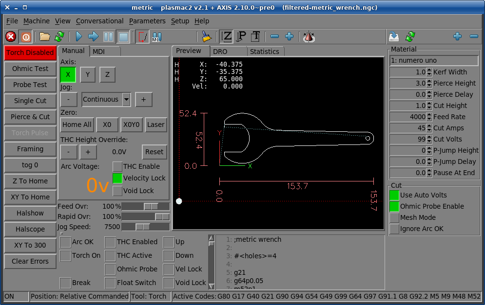

.Portrait (Font: 10, Resolution: 664 x 880)
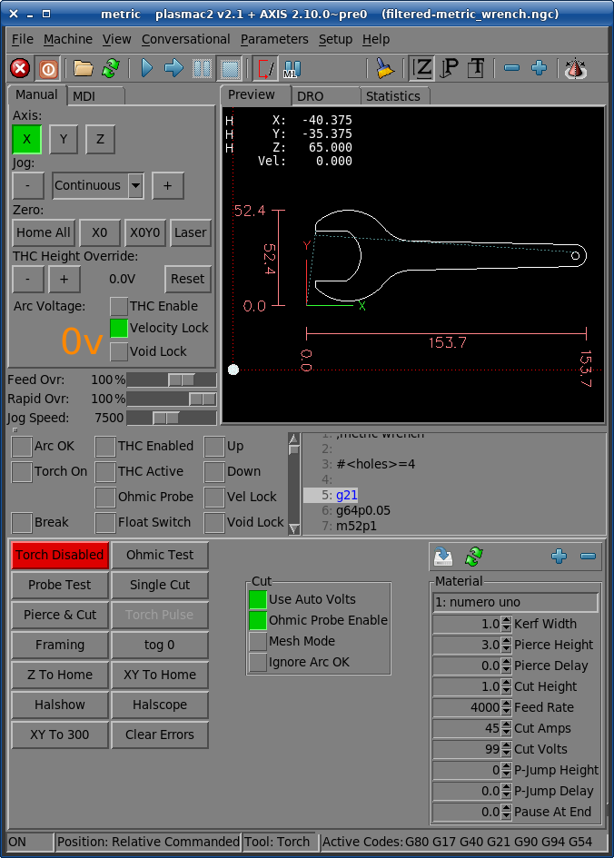

== plasmac2 Prerequesites
Installing plasmac2 is a bit convoluted due to there currently being no way to directly install it via the standard LinuxCNC configuration wizards.
At this time it is necessary to have a working copy of QtPlasmaC and then migrate that to plasmac2 via the plasmac2 migration tool.
Installation Instructions for http://linuxcnc.org/docs/devel/html/plasma/qtplasmac.html#_installing_linuxcnc[installing LinuxCNC] and http://linuxcnc.org/docs/devel/html/plasma/qtplasmac.html#_creating_a_qtplasmac_configuration[installing QtPlasmac] are avaialable in the online http://linuxcnc.org/docs/devel/html/plasma/qtplasmac.html[QtPlasmaC User Manual].

plasmac2 has the same http://linuxcnc.org/docs/devel/html/plasma/qtplasmac.html#plasma:modes[Operating Modes], http://linuxcnc.org/docs/devel/html/plasma/qtplasmac.html#_available_i_os[Available I/Os], and http://linuxcnc.org/docs/devel/html/plasma/qtplasmac.html#plasma:z-settings[Recommended Z Axis Settings] as QtPlasmac.

- The current LinuxCNC version must be master branch (v2.10) or later.
- A working QtPlasmaC configuration must be installed.
- The http://linuxcnc.org/docs/devel/html/plasma/qtplasmac.html#plasma:initial-setup[Initial Setup] procedure for QtPlasmaC must be completed.

Migrating to plasmac2 has no affect on the existing QtPlasmaC configuration, it will remain intact and fully operational.

== Migrating To plasmac2
To begin a migration, call the migrator from a terminal by using one of the following commands depending on the LinuxCNC installation type:

.*_Package installation_*
----
python3 /usr/share/doc/linuxcnc/examples/sample-configs/sim/axis/plasmac2/plasmac2/migrate.py
----

*_Run-In-Place installation_*
----
python3 ~/linuxcnc-dev/configs/sim/axis/plasmac2/plasmac2/migrate.py
----

Click *Migrate* then select the INI file of the configuration you wish to migrate.

You will then be prompted for the directory name of the new configuration which by default will be the original QtPlasmaC directory name appended with __plasmac2_ but can be changed to any valid Linux name.

If you change the new directory name to the same as the original QtPlasmaC configuration then the original QtPlasmaC directory name will be appended with __qtplasmac_.

It is possible that some HAL commands may be incompatible with plasma2, if this is the case then a notification will be shown listing any incompatibilities.

=== plasmac2 Files
After a successful plasmac2 installation, the following files are created in the configuration directory:

.Files
[cols="1,3"]
|===
|*Filename* |*Function*
|_<machine_name>.ini_   |Configuration file for the machine.
|_<machine_name>.hal_   |HAL for the machine.
|_<machine_name>.prefs_ |Configuration file for plasmac2 specific parameters and preferences.
|_custom.hal_           |HAL file for user customization.
|_custom_postgui.hal_   |HAL file for user customization which is run after the GUI has initialized.
|_shutdown.hal_         |HAL file which is run during the shutdown sequence.
|_tool.tbl_             |Tool table used to store offset information for additional tools (scribe, etc.) used by the plasmac2 configuration.
|_plasmac2_             |Link to the directory containing common plasmac2 support files.
|_user_commands.py_     |Users custom python code, run once at startup.
|_user_hal.py_          |Users custom hal pins, run once at startup.
|_user_periodic.py_     |Users custom python code, run every period (default = 100mS).
|===

[NOTE]
_<machine_name>_ is whatever name the user entered into the "Machine Name" field of the configuration wizard program. +
 +
Custom commands are allowed in `custom.hal` and the `custom_postgui.hal` files as they are not overwritten during updates. +

After running a new configuration for the first time the following file will be created in the configuration directory:

.File
[cols="1,2"]
|===
|*Filename*                    |*Function*
|_<machine_name>_material.cfg_ |File for storing the material settings from the  |Material frame of the <<plasmac2:main-page, Main Page>>.
|===

[NOTE]
All the above files are plain text and may be edited with any text editor.

=== INI File
plasmac2 has some specific _<machine_name>_.ini file variables in the following sections:

[[plasmac2:rs274]]
[source,{ini}]
----
[RS274NGC]
RS274NGC_STARTUP_CODE = G21 G40 G49 G80 G90 G92.1 G94 G97 M52P1
SUBROUTINE_PATH       = ./:../../nc_files
USER_M_PATH           = ./:../../nc_files

[FILTER]
PROGRAM_EXTENSION     = .ngc,.nc,.tap G-code File (*.ngc, *.nc, *.tap)
ngc                   = qtplasmac_gcode
nc                    = qtplasmac_gcode
tap                   = qtplasmac_gcode

[HAL]
HALUI                 = halui
HALFILE               = <machine_name>.hal
HALFILE               = plasmac.tcl
HALFILE               = custom.hal
POSTGUI_HALFILE       = postgui_call_list.hal
SHUTDOWN              = shutdown.hal

[DISPLAY]
DISPLAY               = axis

[TRAJ]
SPINDLES              = 3

[AXIS_X]
MAX_VELOCITY          = double the value in the corresponding joint
MAX_ACCELERATION      = double the value in the corresponding joint
OFFSET_AV_RATIO       = 0.5

[AXIS_Y]
MAX_VELOCITY          = double the value in the corresponding joint
MAX_ACCELERATION      = double the value in the corresponding joint
OFFSET_AV_RATIO       = 0.5

[AXIS_Z]
MIN_LIMIT             = just below the top of the table's slats
MAX_VELOCITY          = double the value in the corresponding joint
MAX_ACCELERATION      = double the value in the corresponding joint
OFFSET_AV_RATIO       = 0.5
----

[NOTE]
For imperial configs replace G21 above with G20. +
All the above paths show the minimum requirements. +
See <<plasmac2:path-tolerance,Path Tolerance>> For _RS274NGC_STARTUP_CODE_ information related to G64. +
With the exception of <<plasmac2:tube_cutting,tube cutting>> with an angular A, B, or C axis, plasmac2 uses the LinuxCNC <<cha:external-offsets,External Axis Offsets>> feature for all Z axis motion, and for moving the X and/or Y axis for a consumable change or a cut recovery while paused. +

== plasmac2 GUI Overview
The following sections will give a general overview of the plasmac2 layout and the available functions.

[[plasmac2:main-page]]
=== Main Page
.Main Page - landscape mode

Some functions/features are used only for particular modes and are not displayed if they are not required by the chosen plasmac2 mode.

==== Menu Bar
Some menu items might be grayed out depending on how the INI file is configured.

.File Menu
[cols="3,17"]
|===
|*Name*              |*Description*
|_Open_              |Open a standard dialog box to open a G-code file to load.
|_Recent Files_      |Display a list of recently opened files.
|_Edit_              |Open the current G-code file for editing if there is an editor configured in the INI file.
|_Reload_            |Reload the current G-code file. +
                      If you edited it you must reload it for the changes to take affect. +
                      If you stop a file and want to start from the beginning then reload the file.
|_Save G-code as_    |Save the current file with a new name.
|_Properties_        |Display the properties of the loaded G-code file.
|_Edit tool table_   |Open the tool table for editing if there is an editor configured in the INI file.
|_Reload tool table_ |After editing the tool table you must reload it.
|_Ladder editor_     |Open ClassicLadder for editing if it has been loaded.
|_Quit_              |Terminate the current LinuxCNC session.
|===

.Machine Menu
[cols="4,16"]
|===
|*Name*                        |*Description*
|_Toggle Emergency Stop_       |Change the state of the Emergency Stop.
|_Toggle Machine Power_        |Change the state of the Machine Power if the Emergency Stop is not on.
|_Run Program_                 |Run the currently loaded program from the beginning.
|_Run From Selected Line_      |Select the line you want to start from first.
|_Step_                        |Single step through a program.
|_Pause_                       |Pause a program.
|_Resume_                      |Resume running from a pause.
|_Stop_                        |Stop a running program.
|_Stop at M1_                  |If an M1 is reached, and this is checked, program execution will stop on the M1 lin.
|_Skip lines with "/"_         |If a line begins with / and this is checked, the line will be skipped.
|_Clear MDI history_           |Clears the MDI history window.
|_Copy from MDI history_       |Copies the MDI history to the clipboard
|_Paste to MDI history_        |Paste from the clipboard to the MDI history window
|_Calibration_                 |Starts the Calibration assistant (emccalib.tcl).
|_Show HAL Configuration_      |Opens the HAL Configuration window where you can monitor HAL Components, Pins, Parameters, Signals, Functions, and Threads.
|_HAL Meter_                   |Opens a window where you can monitor a single HAL Pin, Signal, or Parameter.
|_HAL Scope_                   |Opens a virtual oscilloscope that allows plotting HAL values vs. time.
|_Show LinuxCNC Status_        |Opens a window showing LinuxCNC's status.
|_Set Debug Level_             |Opens a window where debug levels can be viewed and some can be set.
|_Homing_                      |Home one or all axes.
|_Unhoming_                    |Unhome one or all axes.
|_Zero Coordinate System_      |Set all offsets to zero in the coordinate system chosen.
|_Tool touch off to workpiece_ |Touch off relative to the current workpiece. +
                                See G10 L10 in the G-code chapter.
|_Tool touch off to fixture_   |Touch off relative to the ninth (G59.3) coordinate system. +
                                See G10 L11 in the G-code chapter.
|===

.View Menu
[cols="4,16"]
|===
|*Name*                      |*Description*
| _Large Preview_            |Show the graphical preview as large as possible
|_Top View_                  |Top View (or Z view) displays the G-code looking along the Z axis from positive to negative.
|_Rotated Top View_          |Rotated Top View (or rotated Z view) also displays the G-code looking along the Z axis from positive to negative
|_Side View_                 |Side View (or X view) displays the G-code looking along the X axis from positive to negative.
|_Front View_                |Front View (or Y view) displays the G-code looking along the Y axis from negative to positive.
|_Perspective View_          |Perspective View (or P view) displays the G-code looking at the part from an adjustable point of view, defaulting to X+, Y-, Z+.
|_Show Program_              |The preview display of the loaded G-code program can be entirely disabled if desired.
|_Show Program Rapids_       |The display of rapid moves (G0) in cyan can be disabled if desired.
|_Alpha-blend Program_       |Make the preview of complex programs easier to see, but may cause the preview to display more slowly.
|_Show Live Plot_            |The highlighting of the feedrate paths (G1,G2,G3) as the tool moves can be disabled if desired.
|_Show Tool_                 |The display of the tool cone/cylinder can be disabled if desired.
|_Show Extents_              |The display of the extents (maximum travel in each axis direction) of the loaded G-code program can be disabled if desired.
|_Show Offsets_              |The offset origin (or fixture zero) display can be disabled if desired.
|_Show Machine Limits_       |The machine's maximum travel limits for each axis can be disabled if desired.
|_Show Velocity_             |Displaying of velocity can be disabled if desired.
|_Show Distance to Go_       |Distance to Go display can be disabled if desired.
|_Coordinates in large font_ |Display in large font in the toolpath view.
|_Clear Live Plot_           |The previously highlighted paths can be cleared.
|_Show Commanded Position_   |This is the position that LinuxCNC will try to go to.
|_Show Actual Position_      |The measured position as read back from the system's encoders or simulated by step generators.
|_Show Machine Position_     |This is the position in unoffset coordinates, as established by Homing.
|_Show Relative Position_    |This is the Machine Position modified by G5x and G43 offsets.
|===

.Conversational Menu
[cols="4,16"]
|===
|*Name*           |*Description*
|_Conversational_ |Show the <<plasmac2:conversational-page,Conversational Page>>
|===

.Parameters Menu
[cols="4,16"]
|===
|*Name*       |*Description*
|_Parameters_ |Show the <<plasmac2:parameters-page,Parameters Page>>
|===

.Setup Menu
[cols="4,16"]
|===
|*Name*  |*Description*
|_Setup_ |Show the <<plasmac2:setup-page,Setup Page>>
|===

.Help Menu
[cols="4,16"]
|===
|*Name*               |*Description*
|_About AXIS_         |Copyright noticese
|_Migration_          |How to migrate to plasmac2
|_Keyboard Shortcuts_ |Shows keyboard shortcuts if enable
|_Keypad Shortcuts_   |Shows keypad shortcuts if enable
|===

==== Toolbar
.Main Toolbar
[cols="4,16"]
|===
|*Name*      |*Description*
|_Estop_     |Reset and/or set Estop depending on the HAL configuration.
|_Power_     |Turn the GUI on/off.
|_Open_      |Open a file dialog to load a G-code file.
|_Reload_    |Reload the current G-code file.
|_Start_     |Start the cycle for any loaded G-code file.
|_Step_      |Single step the cycle for any loaded G-code file.
|_Pause_     |Pause/resume the cycle for any loaded G-code file.
|_Stop_      |Stop any actively running or paused cycle, this includes: +
              G-code Programs. +
              Torch pulse if the pulse was started during `Pause` mode. This will also cancel the paused G-code program. +
              Probe Test. +
              Framing. +
              Manual Cut.
|_Skip_      |Toggle the `skip line` G-code command.
|_Opt Pause_ |Toggle the `optional pause` G-code command.
|===

[[plasmac2:preview-toolbar]]
.Preview Toolbar
[cols="4,16"]
|===
|*Name*  |*Description*
|_Broom_ |Clear the live plot.
|_Z_     |Change the graphical G-code preview to a top down view. +
          This view is selected automatically when a progrm is loaded.
|_P_     |Change the graphical G-code preview to an isometric view.
|_T_     |Change the graphical G-code preview to a top down full table view.
|_-_     |Zoom out the graphical G-code preview.
|_+_     |Zoom in the graphical G-code preview.
|_Cone_  |Switch the graphical G-code preview between drag and rotate.
|===

[[plasmac2:material-toolbar]]
.Material Toolbar
[cols="4,16"]
|===
|*Name*   |*Description*
|_Save_   |Save the current material set to the __<machine_name>___material.cfg file.
|_Reload_ |Reload the material set from the __<machine_name>___material.cfg file.
|_+_      |Add a new material to the material file. +
           The user will be prompted for a material number and a material name, all other parameters will be read from the currently selected material. +
           Once entered, plasmac2 will reload the material file and display the new material. +
           The Cut Parameters for the new material will then need to be adjusted and saved.
|_-_      |Delete the selected material. +
           After pressing *-*, the user will be prompted to confirm the deletion. +
           After deletion, the material file will be reloaded and the drop down list will display the default material.
|===

==== User Buttons
The Button Panel contains buttons useful for the operation of the machine.

The *Torch Enable* button and the *Dry Run* button are permanent, all other buttons are user programmable from the <<plasmac2:setup-page,Setup Page>>
and saved in the _<machine_name>_.prefs file.

See <<plasmac2:user-buttons,custom user buttons>> for detailed information on custom user buttons.

===== Torch Enable

The *Torch Enable* button toggles the torch between enabled and disabled.
To perform a cut the torch must be enabled.
If the torch is disabled then the loaded program will be run without the torch turning on, all pierce points will be probed.

===== Dry Run

Pressing the *Dry Run* button if the table is on and homed and a valid G-code file is loaded will cause the program to be run without the torch turning on and without any probing.
If a alignment laser is fitted then the laser will offset to the cutting position and will then trace the cut path.

[[plasmac2:manual-tab]]
==== Manual Tab
The Manual Tab contains buttons and indicators useful for the operation of the machine.

.Joint Panel
The joint buttons allow individual selection of the joints. These are only displayed if the machine is not homed.

.Axis Panel
The axis buttons allow individual selection of the axes. These are only displayed if the machine is homed.

.Jog Panel
[cols="4,16"]
|===
|*Name*      |*Description*
|_-_         |Jog in the negative direction.
|_+_         |Jog in the positive direction.
|_Drop Down_ |Select the jog distance from `Continuous` through values set in the _<machine_name>_.ini file.
|===

.THC Height Override Panel
[cols="4,16"]
|===
|*Name*  |*Description*
|_+_     |Raise the torch height.
|_-_     |Lower the torch height.
|_Reset_ |Return any voltage override to 0.00.
|===

[NOTE]
The height distance changed will be `Height Per Volt` * `THC Threshold`.

.Arc Voltage Panel
[cols="4,16"]
|===
|*Name*          |*Description*
|_THC Enable_    |Toggle between enabling and disabling THC.
|_Velocity Lock_ |Toggle between enabling and disabling velocity lock (corner lock).
|_Void Lock_     |Toggle between enabling and disabling void lock (kerf crossing).
|===

==== MDI Tab
The MDI Tab allows manually entry of a G-code command when the machine is on and not running any other command.

.MDI Panel
[cols="4,16"]
|===
|*Name*        |*Description*
|_History_     |Shows MDI commands that have been entered previously.
|_MDI Command_ |Enter a G-code command.
|_Go_          |Execute the G-code in the entry.
|===

==== Cut Recovery Tab
The `Cut Recovery` Tab provides controls for recovering from issue that caused a cut to be paused.

.Speed Panel
[cols="4,16"]
|===
|*Name*   |*Description*
|_Rev_    |Move the machine in reverse along the programmed path until it reaches the previous M3 command.
|_Fwd_    |Move the machine forward along the programmed path until program's end.
|_Slider_ |Vary the velocity of the Rev and Fwd motion and displays this velocity in machine units per minute.
|_Laser_  |Enable the laser (if fitted) to allow more precise positioning.
|_Cancel_ |Cancel any Cut Recovery movement that was made, and return the torch to the position at which the Cut Recovery movement was initiated. +
           Note that if Fwd or Rev were used to move the torch, Cancel will not return to the position of the torch when the pause occurred.
|===

.Leadins Panel
[cols="4,16"]
|===
|*Name*               |*Description*
|_Directional Arrows_ |Move the torch in the direction indicated by a distance of one kerf width per press.
|_Value_              |The kerf width of the currently selected material.
|===

[NOTE]
Whenever a G-code program is paused this tab will be shown in lieu of the 'Manual' and 'MDI' tabs. +
Please see <<plasmac2:cut-recovery,Cut Recovery>> for a detailed description of the `Cut Recovery` functionality.

==== Override Panel
.Override Panel
[cols="4,16"]
|===
|*Name*      |*Description*
|_Feed Ovr_  |Override the feed rate for all feed moves to a percentage of the inital value. +
|_Rapid Ovr_ |Override the feed rate for all rapid moves to a percentage of the inital value. +
|_Jog Speed_ |Set the jog feed rate in machine units per minute. +
|===

[[plasmac2:indicator-panel]]
==== Indicator Panel
.Indicator Panel
[cols="4,16"]
|===
|*Name*        |*Description*
|_Arc OK_      |The Arc OK signal.
|_Torch On_    |The Torch On output
|_Break_       |The torch breakaway sensor.
|_THC Enabled_ |THC is enabled.
|_THC Active_  |THC is actively controlling the Z axis.
|_Ohmic_       |The ohmic probe has sensed the material.
|_Float_       |The float switch is activated.
|_Up_          |THC is commanding the Z axis to raise.
|_Down_        |THC is commanding the Z axis to lower.
|_Vel Lock_    |Velocity lock is active.
|_Void Lock_   |Void lock is active.
|===

==== Preview Tab
The plasmac2 preview tab has the ability to be switched between different views and displays, as well as zooming in and out.

Button functions are described in the <<plasmac2:preview-toolbar, Preview Menu>>

When plasmac2 is first started, the 'T' view will be displayed.

When a G-code file is loaded, the display will change to the 'Z' view.

Pressing either *Z*, *T*, or *P* will change the display to the newly selected view.

.Coordinate Display
In the upper-left corner of the program display is the coordinate position display for each joint/axis.
If the INI file variable 'kinstype=BOTH' is present then joints will be displayed if the machine is not homed otherwise axes will be displayed.
To the left of the number a homed symbol `H` is shown if the axis has been homed.

A limit symbol shown on the left side of the coordinate position number/letter if the axis is on one of its limit switches.

To properly interpret the coordinate position numbers, refer to the Position: indicator in the status bar.
If the position is Machine Actual, then the displayed number is in the machine coordinate system.
If it is Relative Actual, then the displayed number is in the offset coordinate system.
When the coordinates displayed are relative and an offset has been set, the display will include a cyan machine origin  cyan machine origin marker.

If the position is 'Commanded', then the exact coordinate given in a G-code command is displayed.
If it is 'Actual', then it is the position the machine has actually moved to.
These values can be different from 'Commanded' position due to following error, dead band, encoder resolution, or step size.

.Preview Plot
When a file is loaded, a preview of it is shown in the display area.
Fast moves (such as those produced by the 'G0' command) are shown as cyan lines.
Moves at a feed rate (such as those produced by the 'G1' command) are shown as solid white lines.
Dwells (such as those produced by the 'G4' command) are shown as small pink X marks.

'G0' (Rapid) moves prior to a feed move will not show on the preview plot.
Rapid moves after a 'T<n>' (Tool Change) will not show on the preview until after the first feed move. To turn either of these features off program a 'G1' without any moves prior to the 'G0' moves.

.Program Extents
The extents of the program in each axis are shown. At the ends, the least and greatest coordinate values are indicated.
In the middle, the difference between the coordinates is shown.

When some coordinates exceed the soft limits in the INI file, the relevant dimension is shown in a different color and enclosed by a box.

.Soft Limits
Figure 2. Soft Limits
Tool Cone
When no tool is loaded, the location of the tip of the tool is indicated by the tool cone.
The tool cone does not provide guidance on the form, length, or radius of the tool.

When a tool is loaded (for instance, with the MDI command 'T1 M6' ), the cone changes to a cylinder which shows the diameter of the tool given in the tool table file.

.Backplot
When the machine moves, it leaves a trail called the backplot.
The color of the line indicates the type of motion: Yellow for jogs, faint green for rapid movements, red for straight moves at a feed rate, and magenta for circular moves at a feed rate.

.Grid
AXIS can optionally display a grid when in orthogonal views. Enable or disable the grid using the Grid menu under View.
When enabled, the grid is shown in the top and rotated top views; when coordinate system is not rotated, the grid is shown in the front and side views as well.
The presets in the Grid menu are controlled by the INI file item '[DISPLAY]GRIDS'.
If unspecified, the default is 10mm 20mm 50mm 100mm 1in 2in 5in 10in.

[WARNING]
Specifying a very small grid may decrease performance.

.Interacting
By left-clicking on a portion of the preview plot, the line will be highlighted in both the graphical and text displays.
By left-clicking on an empty area, the highlighting will be removed.

If a line is selected and the right button clicked then a <<plasmac2:run-from-line,Run From Line>> action is available

By dragging with the left mouse button pressed, the preview plot will be shifted (panned).

By dragging with shift and the left mouse button pressed, or by dragging with the mouse wheel pressed, the preview plot will be rotated.
When a line is highlighted, the center of rotation is the center of the line.
Otherwise, the center of rotation is the center of the entire program.

By rotating the mouse wheel, or by dragging with the right mouse button pressed, or by dragging with control and the left mouse button pressed, the preview plot will be zoomed in or out.

By clicking one of the Preset View icons, or by pressing V, several preset views may be selected.

==== DRO Tab
The 'DRO' tab displays all axes coordinates as well as all current offsets.

[[plasmac2:statistics-tab]]
==== Statistics Tab
The Statistics tab provides statistics to allow for the tracking of consumable wear and job run times.

These statistics are shown for the current job as well as the running total.

Previous job statistics are reset once the next program is run.

The running total values may be reset individually by clicking the corresponding *Reset* button.

==== G-code Text Display
By left-clicking a line of the program, the line will be highlighted in both the graphical and text displays.

If a line is selected and the right button clicked then a <<plasmac2:run-from-line,Run From Line>> action is available

When the program is running, the line currently being executed is highlighted.
If no line has been selected by the user, the text display will automatically scroll to show the current line.

[[plasmac2:material]]
==== Material Panel
.Material Panel
[cols="4,16"]
|===
|*Name*          |*Description*
|_Material_      |The top drop down menu is used to manually select the current material cut parameters. +
                  If there are no materials in the material file then only the default material will be displayed.
|_Kerf Width_    |Set the kerf width for the currently selected material.
                  Refer to the http://linuxcnc.org/docs/devel/html/plasma/qtplasmac.html#plasma:initial-setup[Heights Diagram] diagram for a visual representation.
|_Pierce Height_ |Set the pierce height for the currently selected material.
                  Refer to the http://linuxcnc.org/docs/devel/html/plasma/qtplasmac.html#plasma:initial-setup[Heights Diagram] diagram for a visual representation.
|_Pierce Delay_  |Set the pierce delay (in seconds) for the currently selected material.
|_Cut Height_    |Set the cut height for the currently selected material.
                  Refer to the http://linuxcnc.org/docs/devel/html/plasma/qtplasmac.html#plasma:initial-setup[Heights Diagram] diagram for a visual representation.
|_Feed Rate_     |Set the `Cut Feed Rate` for the currently selected material.
|_Cut Amps_      |Set the cut amperage for the currently selected material. +
                  This is a visual indicator to the operator only, unless PowerMax communications are being used.
|_Cut Volts_     |Set the cut voltage for the currently selected material.
|_P-Jump Height_ |Expressed as a percentage of `Pierce Height`, this sets the Puddle Jump height for the currently selected material. +
                  Typically used for thicker materials, Puddle Jump allows the torch to have an intermediate step between `Pierce Height` and `Cut Height`. +
                  If set, the torch will proceed from `Pierce Height` to `P-Jump Height` for a period of time (`P-Jump Delay`) before proceeding to `Cut Height` to effectively "jump" over the molten puddle. Refer to the http://linuxcnc.org/docs/devel/html/plasma/qtplasmac.html#plasma:initial-setup[Heights Diagram] diagram for a visual representation.
|_P-Jump Delay_  |Set the amount of time (in seconds) the torch will stay at the `P-Jump Height` before proceeding to `Cut Height`.
|_Pause At End_  |Set the amount of time (in seconds) the torch will stay on at the end of the cut before proceeding with the M5 command to turn off and raise the torch.
                  For more information see <<plasmac2:pause-at-end,Pause At End Of Cut>>.
|_Cut Mode_      |Set the cut mode for the currently selected material. +
                  This setting is only valid if PowerMax communications are being used. +
                  1 = Normal +
                  2 = CPA (Constant Pilot Arc) +
                  3 = Gouge/Mark
|_Gas Pressure_  |Set the gas pressure for the currently selected material. +
                  This setting is only valid if PowerMax communications are being used. +
                  0 = Use the PowerMax's automatic pressure mode.
|===

[NOTE]
See the <<plasmac2:thick-materials,thick materials>> section for more information on puddle jump. +
See <<plasmac2:material-toolbar,Material Toolbar>> for a description of the button functions.

==== Cut Panel
.Cut Panel
[cols="4,16"]
|===
|*Name*               |*Description*
|_Use Auto Volts_     |Enable or disable <<plasmac2:thc,Auto Volts>>.
|_Ohmic Probe Enable_ |Enable or disable the ohmic probe input.
|_Mesh Mode_          |Enable or disable <<plasmac2:mesh-mode,Mesh Mode>> for the cutting of expanded metal. +
                       This check box may be enabled or disabled at any time during normal cutting.
|_Ignore Arc OK_      |Determine if plasmac2 ignores the Arc OK signal.
|===

==== Powermax Panel
.Powermax Panel
[cols="4,16"]
|===
|*Name*    |*Description*
|_State_   |Display the current state of the comms interface.
|_Message_ |Display the current comms message.
|===

[NOTE]
The 'Powermax Panel' is only displayed if a PowerMax comms port is specified in the preferences file.

[[plasmac2:conversational-page]]
=== Conversational Page
.Conversational Page - landscape mode
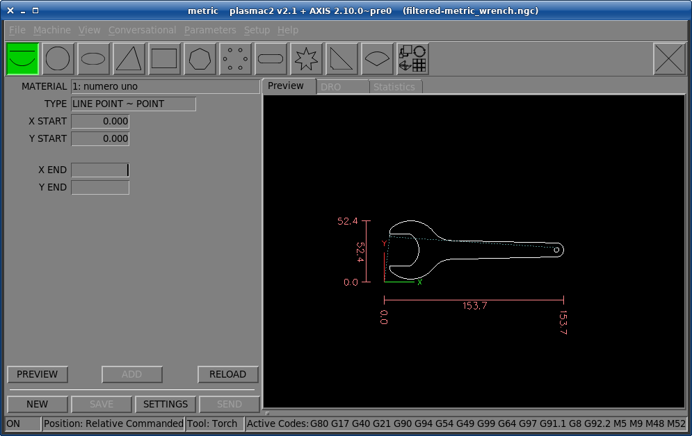

The <<plasmac2:conversational-page,Conversational Page>> enables the user to quickly program various simple shapes for quick cutting without the need for CAM software.

The 'Conversational Shape Library' consists of several basic shapes and functions to assist the user with generating quick G-code at the machine to cut simple shapes quickly.

[NOTE]
The Conversational Library is not meant to be a CAD/CAM replacement as there are limitations to what can be achieved. +

The following rules will apply to conversational shapes.

- All distances are in machine units relative to the current User Coordinate System and all angles are in degrees.
- A 'small hole' is a circle that is smaller than the `SMALL HOLES DIAMETER` specified in the <<plasmac2:conversational-page,Conversational Page>> `SETTINGS`.
- Holes in a 'Bolt Circle' shape will also abide by the above rules.
- Blank entries in the shape input boxes will use the current setting at the time the G-code was generated.
* For example, if `X start` was left blank then the current X axis position would be used.
- All leadins and leadouts are arcs except for `Circle` and `Star`:
- If a `Circle` is external then any leadin or leadout will be an arc.
- If a `Circle` is internal and a `small hole` then any leadin will be perpendicular and there will be no lead out.
- If a `Circle` is internal and not a `small hole` then any leadin and leadout will be an arc.
- If a `Circle` leadin has a length greater than half the radius then the leadin will revert to perpendicular and there will be no leadout.
- If a `Circle` leadout has a length greater than half the radius then there will be no leadout.
- A `Star` leadin is at the same angle as the first cut and the leadout is at the same angle as the last cut.
- The cut order will occur in the same order as the shape was built.

Pressing *Return* on the keyboard while editing parameters will automatically show the preview of the shape if there are enough parameters entered to create the shape.
Clicking any of the available check boxes will do the same.

If there is a G-code file loaded in LinuxCNC (plasmac2) when the <<plasmac2:conversational-page,Conversational Page>> is selected,
that code will be imported into the conversational as the first shape of the job.
If this code is not required then it can be removed by pressing the *NEW* button.

If *NEW* is pressed to remove an added shape that is unsaved or unsent then a warning dialog will be displayed.

==== Buttons
Some buttons will be hidden or disabled depending on the current state of the conversational function.

.Buttons
[cols="4,16"]
|===
|*Name*               |*Description*
|_Material Drop Down_ |Select the desired material for cutting.
|_NEW_                |Remove the current G-code file and load a blank G-code file.
|_SAVE_               |Open a dialog box allowing the current shape to be saved as a G-code file.
|_SETTINGS_           |Allow the changing of the global settings.
|_SEND_               |Load the current shape into LinuxCNC (plasmac2). +
                       If the last edit was not added then it will be discarded.
|_PREVIEW_            |Display a preview of the current shape provided the required information is present.
|_CONTINUE_           |Allows another segment to be added to the current segment/segments. +
                       This button is used for lines and arcs only. 
|_ADD_                |Store the current shape into the current job.
|_UNDO_               |Revert to the previously stored state.
|_Reload_             |Reload the original G-code file or a blank file if none was loaded.
|===

==== Settings
.Settings
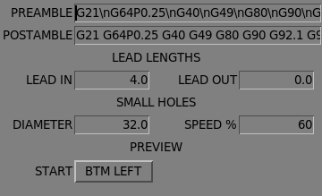

Global settings for the shape library can be set by pressing the *SETTINGS* button in the <<plasmac2:conversational-page,Conversational Page>>.
This will display all of the available settings parameters that are used for G-code program creation.

.Settings
[cols="4,16"]
|===
|*Name*                 |*Description*
|_PREAMBLE_             |G-code commands to run before the conversational shape.
|_POSTAMBLE_            |G-code commands to run after the conversational shape.
|_LEADIN_               |Set the length of the leadin.
|_LEADOUT_              |Set the length of the leadout.
|_SMALL HOLES DIAMETER_ |Holes with a diameter less than this will be `small holes`
|_SMALL HOLES SPEED_    |Set the percentage of the current `Cut Feed Rate` to use for `small holes`
|_START_                |Set the default origin coordinate for the shape, either *CENTER* or *BOTTOM LEFT*.
|===

[NOTE]
Preamble and Postamble may be entered as a string of G-Codes and M-Codes separate by spaces. +
To have each code on an individual line then separate the codes with '\n'.

Pressing the *SAVE* button will save all the settings as displayed.

Pressing the *RELOAD* button will discard any changed but unsaved settings.

Pressing the *EXIT* button will close the setting panel and return to the previous shape.

==== Lines And Arcs
.Lines and Arcs

Lines and arcs have an additional option in that they may be strung together to create a complex shape.

There are two line types and three arc types available:

. `Line` given a start point and an end point.
. `Line` given a start point, length, and angle.
. `Arc` given a start point, way point, and end point.
. `Arc` given a start point, end point, and radius.
. `Arc` given a start point, length, angle, and radius.

To use lines and arcs:

. Press the *Lines and Arcs* button.
. Select the type of line or arc to create.
. Choose the material from the Material drop down. +
  If no material is chosen, the default material (00000) will be used.
. Enter the desired parameters.
. Press *PREVIEW* to see the shape.
. If satisfied with the shape press *CONTINUE*.
. Change the line or arc type if needed and continue this procedure until the shape is complete.
. Press *SEND* to send the G-code file to LinuxCNC (plasmac2) for cutting.

If the user wishes to create a closed shape, they will need to create any required leadin as the first segment of the shape. If a leadout is required it will need to be the last segment of the shape.

[NOTE]
At this stage there is no automatic option for a leadin/leadout creation if the shape is closed.

==== Single Shape
The following shapes are available for creation:

.Single Shapes
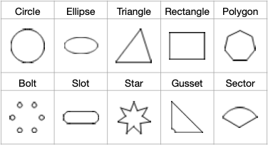

To create a shape:

. Select the corresponding icon for the shape to create.
  The available parameters will be displayed.
. Choose the material from the Material drop down.
  If no material is chosen, the default material (00000) will be used.
. Enter the appropriate values and press *PREVIEW* to display the shape.
. If the shape is not correct, edit the values and press *PREVIEW* and the new shape will be displayed. Repeat until satisfied with the shape.
. Press *ADD* to add the shape to the G-code file.
. Press *SEND* to send the G-code file to LinuxCNC (plasmac2) for cutting.

For *Circle*, the *OVERCUT* button will become valid when a 'CUT TYPE' of *INTERNAL* is selected
and the value entered in the `DIAMETER` field is less than the `SMALL HOLES DIAMETER` parameter in the <<plasmac2:conversational-page,Conversational Page>> *SETTINGS* section.

For *Bolt Circle* the *OVERCUT* button will become valid if the value entered in the `HOLE DIA` field is less than the `SMALL HOLES DIAMETER` parameter in the <<plasmac2:conversational-page,Conversational Page>> *SETTINGS* section.

For the following shapes, `KERF OFFSET` will become active once a `LEAD IN` is specified:

. Triangle
. Rectangle
. Polygon
. Slot
. Star
. Gusset

==== Group Of Shapes
Multiple shapes can be added together to create a complex group.

The cut order of the group is determined by the order in which the individual shapes are added to the group.

Once a shape is added to the group it cannot be edited or removed.

Groups cannot have shapes removed, only added to.

To create a group of shapes:

. Create the first shape as in `Single Shape`.
. Press *ADD* and the shape will be added to the group.
. If the user wishes to add another version of the same shape then edit the required parameters and press *ADD* when satisfied with the shape.
. If the user wishes to add a different shape, select that shape and create it as in `Single Shape`.
. Repeat until all the required shapes to complete the group have been added.
. Press *SEND* to send the G-code file to LinuxCNC (plasmac2) for cutting.

==== Block
.Block

The `Conversational Block` feature allows block operations to be performed on the current shape or group of shapes displayed in the <<plasmac2:conversational-page,Conversational Page>>.
This can include a G-code file not created using the `Conversational Shape Library` that has been previously loaded from the <<plasmac2:main-page,Main Page>>.

A previously saved Block G-code file may also be loaded from the <<plasmac2:main-page,Main Page>> and then have any of its operations edited using the `Conversational Block` feature.

Block operations:

- Rotate
- Scale
- Array
- Mirror
- Flip

To create a block:

. Create a shape, a group, or use a previously loaded G-code file.
. Click the *Block* icon to open the Block tab.
. Enter the appropriate values in the Block tab and press *PREVIEW* to display the resulting changes.
. If the result is not correct, edit the values and press *PREVIEW* and the new result will be shown. Repeat until satisfied with the result.
. Press *ADD* to complete the procedure.
. Press *SEND* to send the G-code file to LinuxCNC (plasmac2) for cutting, or *SAVE* to save the G-code file.

.Block
[cols="5,15"]
|===
|*Name*           |*Description*
|_COLUMNS NUMBER_ |Specify the number of columns.
|_COLUMNS OFFSET_ |Specify the column offset distance.
|_ROWS NUMBER_    |Specify the number of rows.
|_ROWS OFFSET_    |Specify the row offset distance.
|_X ORIGIN_       |offset the result from the X axis origin coordinates.
|_Y ORIGIN_       |offset the result from the Y axis origin coordinates.
|_PATTERN ANGLE_  |rotate the entire result.
|_SHAPE SCALE_    |scale the original shape.
|_SHAPE ROTATION_ |rotate the original shape.
|_SHAPE MIRROR_   |mirror the shape about its X coordinates.
|_SHAPE FLIP_     |flip the shape about its Y coordinates.
|===

If the result is an array of shapes then the cut order of the result is from the left column to the right column, starting at the bottom row and ending at the top row.

==== Saving A Job
The current job displayed in the Preview Panel may be saved at any time by using the bottom *SAVE* button.
If the G-code has been sent to LinuxCNC (plasmac2) and the user has left the <<plasmac2:conversational-page,Conversational Page>>, the user may still save the G-code file from the GUI.

[[plasmac2:parameters-page]]
=== Parameters Page
.Parameters Page - landscape mode
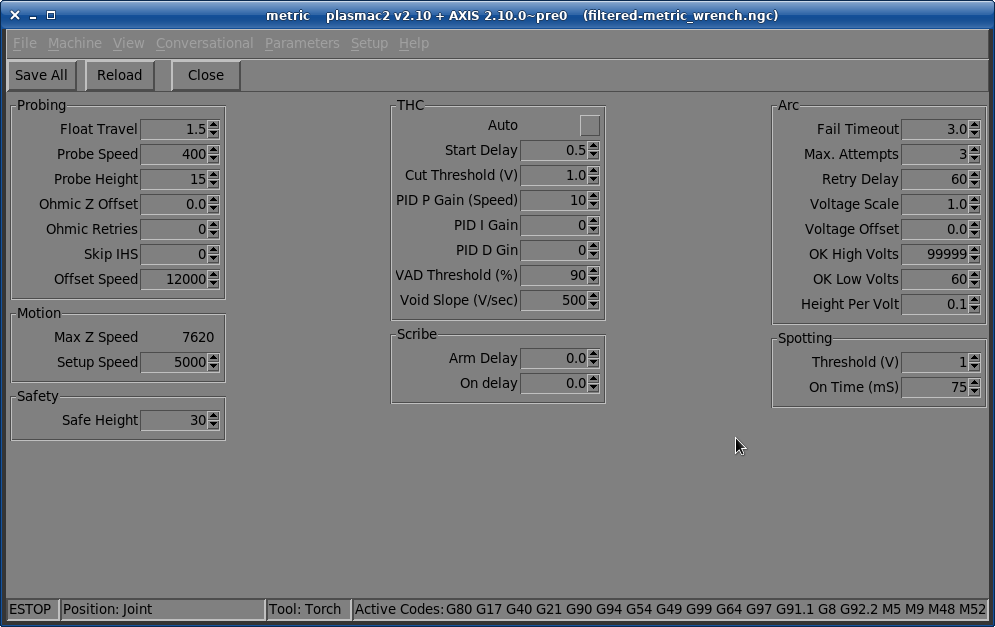

Some functions/features are only used for particular modes and are not displayed if they are not required by the chosen plasmac2 mode.

This page is used to display configuration parameters that are modified infrequently.

==== Buttons
.Buttons
[cols="4,16"]
|===
|*Name*     |*Description*
|_Save All_ |Save the currently displayed parameters to the _<machine_name>_.prefs file.
|_Reload_   |Reload all the parameters from the _<machine_name>_.prefs file.
|_Close_    |Close the <<plasmac2:parameters-page,Parameters Page>> page and return to the <<plasmac2:main-page,Main Page>>.
|===

==== Probing
.Probing
[cols="4,16"]
|===
|*Name*           |*Description*
|_Float Travel_   |Set the amount of travel the float switch moves before completing the float switch circuit.
                   This distance can be measured by using the Probe Test button, and the method described in http://linuxcnc.org/docs/devel/html/plasma/qtplasmac.html#plasma:initial-setup[Initial Setup].
|_Probe Speed_    |Set the speed at which the torch will probe to find the material after it moves to the `Probe Height`.
|_Probe Height_   |Set the height above the Z axis minimum limit that `Probe Speed` begins. Refer to the http://linuxcnc.org/docs/devel/html/plasma/qtplasmac.html#plasma:initial-setup[Heights Diagram] diagram for a visual representation.
|_Ohmic Z Offset_ |Set the distance above the material the torch will should go after a successful ohmic probe.
                   It is mainly used to compensate for high probing speeds.
|_Ohmic Retries_  |Set the number of times plasmac2 will retry a failed ohmic probe before falling back to the float switch for material detection.
|_Skip IHS_       |Set the distance threshold used to determine if an Initial Height Sense (probe) can be skipped for the current cut, see <<plasmac2:ihs-skip,IHS Skip>>.
|_Offset Speed_   |This sets the speed at which the probe will move to the offset position in the X axis and Y axis.
|===

[NOTE]
If the amount of time between the torch contacting the material and when the torch moves up and comes to rest at the `Pierce Height` seems excessive, see <<plasmac2:probing,the probing section>> for a possible solution.

==== Motion
.Motion
[cols="4,16"]
|===
|*Name*        |*Description*
|_Max Z Speed_ |Display the maximum velocity the Z axis is capable of (this is controlled by the _<machine_name>_.ini file).
|_Setup Speed_ |The Z axis velocity for setup moves (movements to `Probe Height`, `Pierce Height`, `Cut Height`, etc.).
|===

[NOTE]
Setup Speed has no effect on THC speed which is capable of the velocity displayed in the Max. Speed field.

==== Safety
.Safety
[cols="4,16"]
|===
|*Name*        |*Description*
|_Safe Height_ |Set the height above the material that the torch will retract to before executing rapid moves. +
                If set to Zero then Z axis maximum height will be used for the safe height. +
                Refer to the http://linuxcnc.org/docs/devel/html/plasma/qtplasmac.html#plasma:initial-setup[Heights Diagram] diagram for a visual representation.
|===

==== THC
.THC
[cols="4,2,14"]
//[frame=ends,grid=none]
|===
|*Name*           |*Modes* |*Description*
|_Auto_           |0, 1, 2 |Selects either `Delay Activation` or `Auto Activation`. +
                            `Delay Activation` (the default) is selected when *Auto* is unchecked. This method uses a time delay set with the `Start Delay` parameter. +
                            `Auto Activation` is selected when *Auto* is checked. This method determines that the arc voltage is stable by using the `Auto Counts` and `Auto Threshold` parameters.
|_Start Delay_    |0, 1, 2 |Set the delay (in seconds) measured from the time the Arc OK signal is received until Torch Height Controller (THC) activates. +
                            This is only available when Auto THC is not enabled.
|_Auto Counts_    |0, 1    |Set the number of consecutive arc voltage readings within THC Sample Threshold required to activate the Torch Height Controller (THC). +
                            This is only available when Auto THC is enabled.
|_Auto Threshold_ |0, 1    |Set the maximum voltage deviation allowed for THC Sample Counts. +
                            This is only available when Auto THC is enabled.
|_Cut Threshold_  |0, 1    |Set the voltage variation allowed from the target voltage before for THC makes movements to correct the torch height.
|_Speed (PID-P)_  |0, 1, 2 |Set the Proportional gain for the THC PID loop. This roughly equates to how quickly the THC attempts to correct changes in height.
|_PID-I_          |0, 1    |Set the Integral gain for the THC PID loop. +
                            Integral gain is associated with the sum of errors in the system over time and is not always needed.
|_PID-D_          |0, 1    |Set the Derivative gain for the THC PID loop. +
                            Derivative gain works to dampen the system and reduce over correction oscillations and is not always needed.
|_VAD Threshold_  |0, 1, 2 |(Velocity Anti Dive) Set the percentage of the current `Cut Feed Rate` the machine can slow to before locking the THC to prevent torch dive.
|_Void Slope_     |0, 1    |(Void Anti Dive) Set the size of the change in cut voltage per seconds necessary to lock the THC to prevent torch dive (higher values need greater voltage change to lock THC).
|===

[NOTE]
Both activation methods begin their calculations when the current velocity of the torch matches the `Cut Feed Rate` specified for the selected material. +
 +
PID loop tuning is a complicated process and is outside the scope of this User Guide.
There are many sources of information available to assist with understanding and tuning PID loops.
If the THC is not making corrections fast enough, it is recommended to increase the P gain in small increments until the system operates favorably.
Large P gain adjustments can result in over correction and oscillations which may require I and/or D adjustments to dampen.

[[plasmac2:scribe-parameter]]
==== Scribe
.Scribe
[cols="4,16"]
|===
|*Name*      |*Description*
|_Arm Delay_ |Set the delay (in seconds) from the time the scribe command is received to the activation of the scribe. +
              This allows the scribe to reach surface of the material before activating the scribe.
|_On Delay_  |Set the delay (in seconds) to allow the scribe mechanism to start before beginning motion.
|===

[[plasmac2:pierce-parameter]]
==== Pierce Only
.Pierce Only
[cols="4,16"]
|===
|*Name*      |*Description*
|_X Offset_ |Moves the pierce point this distance along the X axis when piercing in Pierce Only mode.
|_Y Offset_ |Moves the pierce point this distance along the Y axis when piercing in Pierce Only mode.
|===

==== Arc
.Arc
[cols="4,2,14"]
|===
|*Name*            |*Modes* |*Description*
|_Fail Timeout_    |0, 1, 2 |Set the amount of time (in seconds) plasmac2 will wait between commanding a "Torch On" and receiving an Arc OK signal before timing out and displaying an error message.
|_Max Attempts_    |0, 1, 2 |Set the number of times plasmac2 will attempt to start the arc.
|_Retry Delay_     |0, 1, 2 |Set the time (in seconds) between an arc failure and another arc start attempt.
|_Voltage Scale_   |0, 1    |Set the arc voltage input scale and is used to display the correct arc voltage. +
                             For initial setup, see the http://linuxcnc.org/docs/devel/html/plasma/qtplasmac.html#plasma:mesa-thcad[THCAD] section of the QtPlasmaC User Manual.
|_Voltage Offset_  |0, 1    |Set the arc voltage offset and is used to display zero volts when there is zero arc voltage input. +
                             For initial setup, see the http://linuxcnc.org/docs/devel/html/plasma/qtplasmac.html#plasma:mesa-thcad[THCAD] section of the QtPlasmaC User Manual.
|_OK High Volts_   |0       |Set the voltage threshold below which Arc OK signal is valid.
|_OK Low Volts_    |0       |Set the voltage threshold above which the Arc OK signal is valid.
|_Height Per Volt_ |0, 1, 2 |Set the distance the torch would need to move to change the arc voltage by one volt. +
                             Used for manual height manipulation only.
|===

[NOTE]
When setting the `OK Low Volts` and `OK High Volts` in Mode 0, the cut voltage of a stable arc must be greater than the `OK Low Volts` value but lower than the `OK High Volts` value for plasmac2 to receive a valid Arc OK signal.
To further clarify, to have a valid Arc OK, the arc voltage must fall between the two limits.

==== Spotting
.Spotting
[cols="4,16"]
|===
|*Name*      |*Description*
|_Threshold_ |Set the arc voltage at which the delay timer will begin. +
              0V starts the delay when the torch on signal is activated.
|_On Time_   |Set the length of time (in milliseconds) the torch is on after threshold voltage is reached.
|===

[[plasmac2:setup-page]]
=== Setup Page
.Setup Page - landscape mode
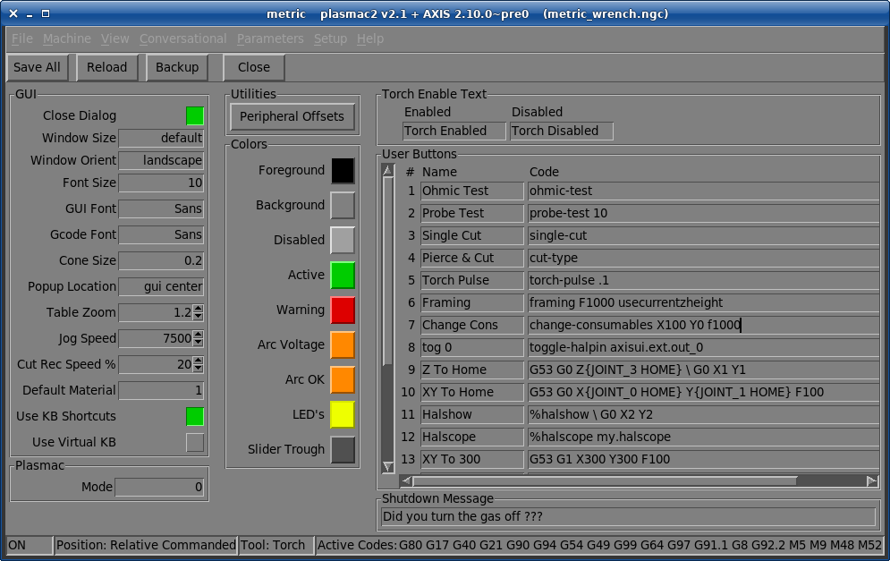

This page is used to display GUI configuration parameters, button text, and shutdown text that are modified infrequently as well as some utility buttons.

==== Buttons
.Buttons
[cols="4,16"]
|===
|*Name*     |*Description*
|_Save All_ |Save the currently displayed settings to the _<machine_name>_.prefs file.
|_Reload_   |Reload all the settings from the _<machine_name>_.prefs file.
|_Backup_   |Create a compressed backup of the configuration directory to the users home directory.
|_Close_    |Close the <<plasmac2:setup-page,Setup Page>> and return to the <<plasmac2:main-page,Main Page>>.
|===

==== GUI
.GUI
[cols="4,16"]
|===
|*Name*             |*Description*
|_Close Dialog_     |Enable the display of a closing dialog.
|_Window Size_      |Set the window size to default, last, maximised, or fullscreen. +
                     `default` will set the window to the minimum required size for the selected font. +
                     `last` will set the window to the size when last closed.
|_Window Orient_    |Set the window orientation to either landscape or portrait.
|_Font Size_        |Set the size of the font from 7 ~ 20.
|_GUI Font_         |Set the font style for all but the G-code text display.
|_Gcode Font_       |Set the font style of the G-code text display.
|_Cone Size_        |Set the size of the preview cone.
|_Popup Location_   |Determine wher the popup messages appear: GUI center, widow center, or at the mouse pointer.
|_Table Zoom_       |Set the table zoom so it fits in the preview.
|_Jog Speed_        |Set the default jog speed.
|_Cut Rec Speed_    |Set the percentage of the `Cut Feed Rate` to use for cut recovery motion.
|_Default Material_ |Set the default material number.
|_Use KB Shortcuts_ |Enable keyboard shortcuts.
|_Use Virtual KB_   |Enable a virtual keyboard.
|===

==== Plasmac
.Plasmac
[cols="4,16"]
|===
|*Name* |*Description*
|_Mode_ |Set the operation mode for the plasmac component. +
         `0` uses an external arc voltage input to calculate both `Arc Voltage` and `Arc OK`. +
         `1` uses an external arc voltage input to calculate `Arc Voltage` and an external transfer input for `Arc OK`. +
         `2` uses an external transfer input for `Arc OK` and external up and down signals for `Torch Height Control`.
|===

==== Utilities
.Utilities
[cols="4,16"]
|===
|*Name*               |*Description*
|_Peripheral Offsets_ |Set the offset for any installed peripherals. +
                       Peripherals include a laser for sheet alignment, a scribe, or offset probing.
|===

[NOTE]
The required offsets for these peripherals need to be applied by following the procedure described in <<plasmac2:peripheral-offsets,Peripheral Offsets>>.

==== Colors
.Colors
[cols="4,16"]
|===
|*Name*          |*Description*
|_Foreground_    |Set the foreground color of all widgets.
|_Background_    |Set the background color of all widgets.
|_Disabled_      |Set the color of all disabled widgets.
|_Active_        |Set the color of active buttons.
|_Warning_       |Set the warning color of widgets.
|_Arc Voltage_   |Set the color of the Arc Voltage display.
|_Arc OK_        |Set the on color of the Arc OK LED.
|_LED's_         |Set the on color of all LED's.
|_Slider Trough_ |Set the trough color of all sliders.
|===

==== Torch Enable Text
.Torch Enable Text
[cols="4,16"]
|===
|*Name*     |*Description*
|_Enabled_  |Set the text to dislay when the torch is enabled.
|_Disabled_ |Set the text to dislay when the torch is disabled.
|===

[[plasmac2:user_button_entry]]
==== User Button Entry
.User Button Entry
[cols="4,16"]
|===
|*Name* |*Description*
|_Name_ |Set the text to dislay on the user button.
|_Code_ |Set the code to execute when the user button is pressed.
|===

. A full description of the functionality is in the <<plasmac2:user-buttons,Custom User Buttons>> section.
. User buttons may be changed and the new settings used without restarting LinuxCNC.
. The `Name` and/or `Code` may be edited at any time and will be loaded ready for use if the *Save All* button is clicked.
. Deleting the `Name` and `Code` text will cause that user button to be hidden if the *Save All* button is clicked.
. To return all the `Name` and `Code` text to their last saved values press the *Reload* button.

[NOTE]
There are 20 user buttons available but not all may be displayed depending on the window size.

[[plasmac2:exit-warning]]
==== Shutdown Message
.Shutdown Message
[cols="4,16"]
|===
|*Name*             |*Description*
|_Shutdown Message_ |The custom message to be displayed if *Close Dialog* is enabled.
|===

== Using plasmac2
Once plasmac2 is successfully installed, no Z axis motion is required to be part of the G-code cut program.
In fact, if any Z axis references are present in the cut program, the standard plasmac2 configuration will remove them during the program loading process.
See note below for exceptions to this rule.

For reliable use of plasmac2 the user should NOT use any Z axis offsets other than the coordinate system offsets (`G54`-`G59.3`).
For this reason, G92 offsets have been disabled within plasmac2.

plasmac2 will automatically add a line of G-code to move the Z axis to the correct height at the beginning of every G-code program.

[NOTE]
It is possible to keep Z motion for use with different tools by adding the magic comment <<plasmac2:keep_z,#<keep-z-motion>=1>>.
If using an angular A, B, or C axis for <<plasmac2:tube_cutting,tube cutting>> then Z axis motion is required in the G-code file. +

*_Version Information_* - plasmac2 will display versioning information in the title of the main window.
The information will be displayed as `plasmac2 v2.n + AXIS n.n (f)` where `n` is the version of plasmac2, `n.n` is the version of AXIS, and `f` is the name of the loaded G-code program.

=== Exiting plasmac2
Exiting or shutting down plasmac2 is done by either:

. Click the window shutdown button on the window title bar
. From the menu click `File` -> `Quit`.

A shutdown warning can be displayed on every shutdown by checking the *Close Dialog* checkbox on the <<plasmac2:setup-page,Setup Page>>.

A custom warning message may be entered in the `Shutdown Message` entry on the <<plasmac2:setup-page,Setup Page>>.

=== Units Systems
All settings and parameters in plasmac2 are required to be in the same units as specified in the INI file, being either metric or imperial.

If the user is attempting to run a G-code file that is in the "other" units system then all parameters including the material file parameters are still required to be in the native machines units.
Any further conversions necessary to run the G-code file will be handled automatically by the G-code filter program.

For example:
If a user had a metric machine and wished to run a G-code file that was set up to cut 1/4" thick material using imperial units (inch = `G20`) then the user with the metric machine would need to ensure that either the material number in the G-code file was set to the corresponding metric material to be cut, or that a new material is created with the correct metric parameters for the metric material to be cut.
If the metric user wanted to cut the G-code file using imperial material, then the new material parameters would need to be converted from imperial units to metric when they are entered.

=== Preamble and Postamble Codes
The following stanzas are the minimum recommended codes to include in the preamble and postamble of any G-code file to be run by plasmac2:

Metric:
[source,{ngc}]
----
G21 G40 G49 G64p0.1 G80 G90 G92.1 G94 G97
----

Imperial:
[source,{ngc}]
----
G20 G40 G49 G64p0.004 G80 G90 G92.1 G94 G97
----

A detailed explanation of each G-code can be found in the docs http://linuxcnc.org/docs/devel/html/gcode/g-code.html[here].

Note that throughout this user guide there are several additional recommendations for codes that are prudent to add to both the preamble and postamble depending on the features the user wishes to utilize.

=== Mandatory Codes
Aside from the preamble code, postamble code, and X/Y motion code, the only mandatory G-code syntax for plasmac2 to run a G-code program using a torch for cutting is `M3 $0 S1` to begin a cut and `M5 $0` to end a cut.

For backwards compatibility it is permissible to use `M3 S1` in lieu of `M3 $0 S1` to begin a cutting job and `M5` in lieu of `M5 $0` to end a cutting job.
Note, that this applies to cutting jobs only, for scribe and spotting jobs the `$n` tool identifier is mandatory.

=== Coordinates
See http://linuxcnc.org/docs/devel/html/plasma/qtplasmac.html#plasma:z-settings[Recommended Z Axis Settings].

Each time LinuxCNC (plasmac2) is started Joint homing is required.
This allows LinuxCNC (plasmac2) to establish the known coordinates of each axis and set the soft limits to the values specified in the _<machine_name>_.ini file in order to prevent the machine from crashing into a hard stop during normal use.

If the machine does not have home switches then the user needs to ensure that all axes are at the home coordinates specified in the _<machine_name>_.ini file before homing.

If the machine has home switches then it will move to the specified home coordinates when the Joints are homed.

Depending on the machine's configuration there will either be a *Home All* button or each axis will need to be homed individually.
Use the appropriate button/buttons to home the machine.

As mentioned in the http://linuxcnc.org/docs/devel/html/plasma/qtplasmac.html#plasma:initial-setup[Initial Setup] section, it is recommended that the first time plasmac2 is used that the user ensure there is nothing below the torch then jog the Z axis down until it stops at the Z axis MINIMUM_LIMIT then click the *Z0* in the <<plasmac2:manual-tab,Manual Tab>> to `Touch Off` the Z axis to zero.
This should not need to be done again.

If the user intends to place the material in the exact same place on the table every time, the user could jog the X and Y axes to the machine to the corresponding X0 Y0 position as established by the CAM software and then `Touch Off` both axes with a zero offset.

If the user intends to place the material randomly on the table then the user must `Touch Off` the X and Y axes at the appropriate position before starting the program.

=== Cut Feed Rate
plasmac2 is able to read a material file to load all the required cut parameters.
To enable to G-code file to use the `Cut Feed Rate` setting from the cut parameters use the following code in the G-code file:

[source,{ngc}]
----
F#<_hal[plasmac.cut-feed-rate]>
----

It is possible to use the standard G-code `F` word to set the `Cut Feed Rate` as follows:

[source,{ngc}]
----
F 1000
----

If the `F` word is used and the `F` word value does not match the `Cut Feed Rate` of the selected material then a warning dialog will indicate this during loading of the G-code file.

[[plasmac2:material-handling]]
=== Material File
Material handling uses a material file that was created for the machine configuration when the configuration wizard was ran and allows the user to conveniently store known material settings for easy recall either manually or automatically via G-code.
The resulting <<plasmac2:material-file, material file>> is named __<machine_name>___material.cfg.

plasmac2 does not require the use of a material file. Instead, the user could change the cut parameters manually from the  |Material frame of the <<plasmac2:main-page, Main Page>>.
It is also not required to use the automatic material changes.
If the user does not wish to use this feature they can simply omit the material change codes from the G-code file.

It is also possible to not use the material file and <<plasmac2:magic-comments,automatically load materials>> from within the G-code file.

[[plasmac2:material-file]]
Material numbers in the materials file do not need to be consecutive nor do they need to be in numerical order.

The following variables are mandatory and an error message will appear if any are not found when the material file is loaded.

* PIERCE_HEIGHT
* PIERCE_DELAY
* CUT_HEIGHT
* CUT_SPEED

[NOTE]
If doing <<plasmac2:tube_cutting,tube cutting>> using the #<tube_cut>=1 magic comment then the only mandatory variable is PIERCE_DELAY, all other variables are optional.

The following variables are optional. If they are not detected or have no value assigned, they will be assigned a value of 0 and no error message will appear.

* NAME
* KERF_WIDTH
* THC
* PUDDLE_JUMP_HEIGHT
* PUDDLE_JUMP_DELAY
* CUT_AMPS
* CUT_VOLTS
* PAUSE_AT_END
* GAS_PRESSURE
* CUT_MODE

[NOTE]
Material numbers 1000000 and above are reserved for temporary materials.

[WARNING]
It is the responsibility of the operator to ensure that the variables are included if they are a requirement for the G-code to be run.

The material file uses the following format:

[source,{ini}]
----
[Material_NUMBER_1]
NAME                = name
KERF_WIDTH          = value
THC                 = value (0 = off, 1 = on)
PIERCE_HEIGHT       = value
PIERCE_DELAY        = value
PUDDLE_JUMP_HEIGHT  = value
PUDDLE_JUMP_DELAY   = value
CUT_HEIGHT          = value
CUT_SPEED           = value
CUT_AMPS            = value (for info only unless PowerMax communications is enabled)
CUT_VOLTS           = value (modes 0 & 1 only, if not using auto voltage sampling)
PAUSE_AT_END        = value
GAS_PRESSURE        = value (only used for PowerMax communications)
CUT_MODE            = value (only used for PowerMax communications)
----

It is possible to add new material, delete material, or edit existing material from the <<plasmac2:parameters-page,Parameters Page.>>.
It is also possible to achieve this by using <<plasmac2:magic-comments,magic comments>> in a G-code file.

The material file may be edited with a text editor while LinuxCNC is running.
After any changes have been saved, press *Reload* in the  |Material frame of the <<plasmac2:main-page, Main Page>> to reload the material file.

=== Manual Material Handling
For manual material handling, the user would manually select the material from the materials list in the  |Material frame of the <<plasmac2:main-page, Main Page>> before starting the G-code program.
In addition to selecting materials with materials list in the  |Material frame of the <<plasmac2:main-page, Main Page>>, the user could use the MDI to change materials with the following command:

[source,{ngc}]
----
M190 Pn
----

The following code is the minimum code necessary to have a successful cut using the manual material selection method:

[source,{ngc}]
----
F#<_hal[plasmac.cut-feed-rate]>
M3 $0 S1
.
.
M5 $0
----

[NOTE]
Manual material handling will restrict the user to only one material for the entire job.

=== Automatic Material Handling
For automatic material handling, the user would add commands to their G-code file which will enable plasmac2 to change the material automatically.

The following codes may be used to allow plasmac2 to automatically change materials:

* `M190 Pn` - Changes the currently displayed material to material number `n`.
* `M66 P3 L3 Q1` - Adds a small delay (1 second in this example) to wait for plasmac2 to confirm that it successfully changed materials.
* `F#<_hal[plasmac.cut-feed-rate]>` - Sets the `Cut Feed Rate` to the feed rate shown in the  |Material frame of the <<plasmac2:main-page, Main Page>>.

For automatic material handling, the codes MUST be applied in the order shown.
If a G-code program is loaded which contains one or more material change commands then the first material will be displayed in the Materials entry on the <<plasmac2:main-page,Main Page>> as the program is loading.

.Minimum code necessary to have a successful cut using the automatic material selection method:
[source,{ngc}]
----
M190 Pn
M66 P3 L3 Q1
F#<_hal[plasmac.cut-feed-rate]>
M3 $0 S1
.
.
M5 $0
----

[[plasmac2:magic-comments]]
=== Material Addition Via Magic Comments In G-code
By using "magic comments" in a G-code file it is possible to do the following:

- Add new materials to the __<machine_name>___material.cfg file.
- Edit existing materials in the __<machine_name>___material.cfg file.
- Use one or more temporary materials.

Temporary materials are numbered automatically by plasmac2 and the material change will also be done by plasmac2 and should not be added to the G-code file by CAM software or otherwise.
The material numbers begin at 1000000 and are incremented for each temporary material.
It is not possible to save a temporary material, however the user could create a new material while a temporary material is displayed and it will use the settings from the temporary material as the defaults.

TIP: It is possible to use temporary materials only and have an empty __<machine_name>___material.cfg file. This negates the need to keep the plasmac2 materials file updated with the CAM tool file.

- The entire comment must be in parentheses.
- The beginning of the magic comment must be: _(o=_
- The equals sign must immediately follow each parameter with no space.
- The mandatory parameters must be in the magic comment (for option 0, _na_ is optional and _nu_ is not used).
- There can be any number and type of magic comments in a G-code file.
- If option 0 is to be used in addition to option 1 and/or option 2 then all option 0 must appear after all option 1 or all option 2 in the G-code file.

The options are:

[cols="1,7"]
|===
|*Option* |*Description*
|_0_      |Creates a temporary default material. +
           Material information added with this option will be discarded by a LinuxCNC restart or materials reload. +
           They may also be overwritten by a new G-code file that has temporary materials.
|_1_      |Adds a new material if the number specified does not exist.
|_2_      |Overwrites an existing material if the number specified exists. +
           Adds a new material if the number specified does not exist.
|===

Mandatory parameters are:

[cols="1,7"]
|===
|*Name* |*Description*
|_o_    |Selects the option to be used.
|_nu_   |Sets the material number (not used for option 0).
|_na_   |Sets the material name (optional for option 0).
|_ph_   |Sets the pierce height.
|_pd_   |Sets the pierce delay.
|_ch_   |Sets the cut height.
|_fr_   |Sets the feed rate.
|===

Optional parameters are:

[cols="1,7"]
|===
|*Name* |*Description*
|_kw_   |Sets the kerf width.
|_th_   |Sets the THC status (0=disabled, 1=enabled).
|_ca_   |Sets the cut amps.
|_cv_   |Sets the cut voltage.
|_pe_   |Sets the pause at end delay.
|_gp_   |Sets the gas pressure (PowerMax).
|_cm_   |Sets the cut mode (PowerMax).
|_jh_   |Sets the puddle jump height.
|_jd_   |Sets the puddle jump delay.
|===

A complete example:

[source,{ngc}]
----
(o=0, nu=2, na=5mm Mild Steel 40A, ph=3.1, pd=0.1, ch=0.75, fr=3000, kw=0.5, th=1, ca=45, cv=110, pe=0.1, gp=5, cm=1, jh=0, jd=0)
----

If a temporary material has been specified in a G-code file then the material change line (`M190...`) and wait for change line (`M66...`) will be added by the G-code filter and are not required in the G-code file.

=== Material Converter
This application is used to convert existing tool tables into plasmac2 material files. It can also create a material file from manual user input to entry fields.

At this stage the only conversions available are for tool tables exported from either SheetCam or Fusion 360.

SheetCam tool tables are complete and the conversion is fully automatic.
The SheetCam tool file must be in the SheetCam .tools format.

Fusion 360 tool tables do not have all of the required fields so the user will be prompted for missing parameters.
The Fusion 360 tool file must be in the JSON format of Fusion 360.

The operation of this application is shown in the http://linuxcnc.org/docs/devel/html/plasma/qtplasmac.html#_material_converter[Material Converter] section of the QtPlasmaC User Manual.

[[plasmac2:laser]]
=== Laser
plasmac2 has the ability to use a laser to set the origin with or without rotation compensation. The Laser button will be enabled after the machine is homed.

To use this feature, the user must set the laser's offset from the torch center by following the procedure described in <<plasmac2:peripheral-offsets,Peripheral Offsets>>.

To modify the offsets manually, the user could edit either or both the following lines in the `[LASER_OFFSET]` section of the _<machine_name>_.prefs file:

[source,{ini}]
----
X axis = n.n
Y axis = n.n
----

where `n.n` is distance from the center line of the torch to the laser's cross hairs.

Additionally, the laser can be tied to any available output to turn the laser on and off via a HAL pin with the following name:

[source,{hal}]
----
axisui.laser_on
----

*To set the origin with zero rotation:*

. Click the *Laser* button.
. *Laser* button label will change to *Mark* and the HAL pin named axisui.laser_on will be turned on.
. Jog until the laser cross hairs are on top of the desired origin point.
. Press *Mark*. The *Mark* button label will change to *Origin*.
. Press *Origin*. The *Origin* button label will change to *Mark* and the HAL pin named axisui.laser_on will be turned off.
. The torch will now move to the X0 Y0 position.
. The offset is now successful set.

*To set the origin with rotation:*

. Click the *Laser* button.
. *Laser* button label will change to *Mark* and the HAL pin named axisui.laser_on will be turned on.
. Jog until the laser cross hairs are at the edge of the material a suitable distance away from the desired origin point.
. Press *Mark*. The *Mark* button label will change to *Origin*.
. Jog until the laser cross hairs are at the origin point of the material.
. Press *Origin*. The *Origin* button label will change to *Mark* and the HAL pin named axisui.laser_on will be turned off.
. The torch will now move to the X0 Y0 position.
. The offset is now successfully set.

*To turn the laser off and cancel an alignment:*

. Press the *Laser* button and hold for longer than 750 mSec.
. *Laser* button label will change to *Laser* and the HAL pin named axisui.laser_on will be turned off.
. Release the *Laser* button.

If an alignment laser has been set up then it is possible to use the laser during <<plasmac2:cut-recovery,Cut Recovery>> for accurate positioning of the new start coordinates.

[[plasmac2:path-tolerance]]
=== Path Tolerance
Path tolerance is set with a G64 command and a following P value. The P value corresponds to the amount that the actual cut path followed by the machine may deviate from the programmed cut path.

The default LinuxCNC path tolerance is set for maximum speed which will severely round corners when used with normal plasma cutting speeds.

It is recommended that the path tolerance is set by placing the appropriate G64 command and P value in the header of each G-code file.

The provided G-code filter program will test for the existence of a `G64 Pn` command prior to the first motion command.
If no G64 command is found it will insert a `G64 P0.1` command which sets the path tolerance to 0.1mm.
For a imperial configuration the command will be `G64 P0.004`.

.For Metric:
[source,{ngc}]
----
G64 P0.1
----

.For Imperial:
[source,{ngc}]
----
G64 P0.004
----

[[plasmac2:paused-motion]]
=== Paused Motion
plasmac2 has the ability to allow the repositioning of the X and Y axes along the current cut path while the G-code program is paused.

In order to use this feature, LinuxCNC's Adaptive Feed Control `M52` must be turned on `P1`.

To enable `Paused Motion` The preamble of the G-code must contain the following line:

[source,{ngc}]
----
M52 P1
----

To turn off `Paused Motion` at any point, use the following command:

[source,{ngc}]
----
M52 P0
----

[[plasmac2:pause-at-end]]
=== Pause At End Of Cut
This feature can be used to allow the arc to "catch up" to the torch position to fully finish the cut.
It is usually required for thicker materials and is especially useful when cutting stainless steel.

Using this feature will cause all motion to pause at the end of the cut while the torch is still on.
After the dwell time (in seconds) set by the `Pause At End` parameter in the  |Material frame of the <<plasmac2:main-page, Main Page>> has expired, plasmac2 will proceed with the M5 command to turn off and raise the torch.

[[plasmac2:multi-tool]]
=== Multiple Tools
plasmac2 has the ability to allow the use of more than one type of plasma tool by utilizing LinuxCNC spindles as a plasma tool when running a G-code program.

Valid plasma tools for use are:

[cols="3,2,10"]
|===
|*Name*         |*TOOL #* |*Description*
|_Plasma Torch_ |0        |Used for normal Plasma cutting.
|_Scribe_       |1        |Used for material engraving.
|_Plasma Torch_ |2        |Used for spotting (creating dimples to aid in drilling).
|===

A LinuxCNC spindle number (designated by `$n`) is required to be in the starting command and also the end command to be able to start and stop the correct plasma tool.
Examples:

* `M3 $0 S1` will select and start the plasma cutting tool.
* `M3 $1 S1` will select and start the scribe.
* `M3 $2 S1` will select and start the plasma spotting tool.

* `M5 $0` will stop the plasma cutting tool.
* `M5 $1` will stop the scribe.
* `M5 $2` will stop the plasma spotting tool.

It is permissible to use `M5 $-1` in lieu of the `M5 $n` codes above to stop all tools.

In order to use a scribe, it is necessary for the user to add the X and Y axis offsets to the LinuxCNC tool table.
Tool 0 is assigned to the Plasma Torch and Tool 1 is assigned to the scribe.
Tools are selected with a `Tn M6` command, and then a `G43 H0` command is required to apply the offsets for the selected tool.
It is important to note that the LinuxCNC tool table and tool commands only come into play if the user is using a <<plasmac2:scribe,scribe>> in addition to a plasma torch.
For more information, see <<plasmac2:scribe,scribe>>.

[[plasmac2:velocity-reduction]]
=== Velocity Reduction
There is a HAL pin available named `motion.analog-out-03` that can be changed in G-code with the `M67` (`Synchronized with Motion`) or `M68` (`Immediate`) commands.
This pin will reduce the velocity to the percentage specified in the command.

The <<plasmac2:halpin-setting,HAL Pin Setting>> section of this manual explains the differences between `Synchronized with Motion` and `Immediate`.

Examples:

* `M67 E3 Q0` would set the velocity to 100% of `Cut Feed Rate`.
* `M67 E3 Q40` would set the velocity to 40% of `Cut Feed Rate`.
* `M67 E3 Q60` would set the velocity to 60% of `Cut Feed Rate`.
* `M67 E3 Q100` would set the velocity to 100% of `Cut Feed Rate`.

The minimum percentage allowed is 10%, values below this will be set to 10%.

The maximum percentage allowed is 100%, values above this will be set to 100%.

If the user intends to use this feature it would be prudent to add `M68 E3 Q0` to both the preamble and postamble of the G-code program so the machine starts and ends in a known state.

[IMPORTANT]
`G-code THC` and `Velocity Based THC` are not able to be used if `Cutter Compensation` is in effect, an error message will be displayed.

[WARNING]
If `Cut Feed Rate` in the  |Material frame of the <<plasmac2:main-page, Main Page>> is set to Zero then plasmac2 will use `motion.requested-velocity` (as set by a standard feedrate call in the G-code) for the THC calculations. This is not recommended as it is not a reliable way of implementing `Velocity Based THC`.

[NOTE]
All references to `Cut Feed Rate` refer to the `Cut Feed Rate` value displayed in the  |Material frame of the <<plasmac2:main-page, Main Page>>.

[[plasmac2:thc]]
=== THC (Torch Height Controller)
The THC can be enabled or disabled from the THC frame of the <<plasmac2:main-page,Main Page>>.

The THC can also be enabled or disabled directly from the G-code program.

The THC does not become active until the velocity reaches 99.9% of the `Cut Feed Rate` and then the `THC Delay` time if any in the THC section of the <<plasmac2:parameters-page,Parameters Page>> has timed out. This is to allow the arc voltage to stabilize.

plasmac2 uses a control voltage which is dependent on the state of the *AUTO VOLTS* checkbox on the <<plasmac2:main-page,Main Page>>:

. If *Use Auto Volts* is checked then the actual cut voltage is sampled at the end of the `THC Delay` time and this is used as the target voltage to adjust the height of the torch.
. If *Use Auto Volts* is not checked then the voltage displayed as Cut Volts in the  |Material frame of the <<plasmac2:main-page, Main Page>> is used as the target voltage to adjust the height of the torch.

.*_G-code THC_*
THC may be disabled and enabled directly from G-code, provided the THC is not disabled in the THC Section of the <<plasmac2:main-page,Main Page>>, by setting or resetting the `motion.digital-out-02` pin with the M-Codes `M62`-`M65`:

* `M62 P2` will disable THC (`Synchronized with Motion`)
* `M63 P2` will enable THC (`Synchronized with Motion`)
* `M64 P2` will disable THC (`Immediate`)
* `M65 P2` will enable THC (`Immediate`)

The <<plasmac2:halpin-setting,HAL Pin Setting>> section of this manual explains the differences between `Synchronized with Motion` and `Immediate`.

[[plasmac2:velocity_thc]]
.*_Velocity Based THC_*
If the cut velocity falls below a percentage of `Cut Feed Rate` (as defined by the `VAD Threshold` % value in the THC frame of the  <<plasmac2:parameters-page,Parameters Page>>) the THC will be locked until the cut velocity returns to at least 99.9% of `Cut Feed Rate`.
This will be made apparent by the `Velocity Lock `indicator illuminating in the <<plasmac2:indicator-panel,Indicator Panel>> on the <<plasmac2:main-page,Main Page>>.

`Velocity Based THC` prevents the torch height being changed when velocity is reduced for a sharp corner or a `small hole`.

It is important to note that <<plasmac2:velocity-reduction,Velocity Reduction>> affects the `Velocity Based THC` in the following ways:

. If `Velocity Reduction` is invoked in the middle of the cut, the THC will be locked.
. The THC will remain locked until the `Velocity Reduction` is canceled by returning it to a value that is above the 'VAD Threshold', and the torch actually reaches 99.9% of the `Cut Feed Rate`.

[[plasmac2:cutter-compensation]]
=== Cutter Compensation
LinuxCNC (plasmac2) has the ability to automatically adjust the cut path of the current program by the amount specified in `Kerf Width` of the selected material's Cut Parameters.
This is helpful if the G-code is programmed to the nominal cut path and the user will be running the program on different thickness materials to help ensure consistently sized parts.

To use cutter compensation the user will need to use `G41.1`, `G42.1`, or `G40` with the `plasmac.kerf-width` HAL pin:

* `G41.1 D#<_hal[plasmac.kerf-width]>` : offsets torch to the left of the programmed path
* `G42.1 D#<_hal[plasmac.kerf-width]>` : offsets torch to the right of the programmed path
* `G40` turns the cutter compensation off

[IMPORTANT]
If 'Cutter Compensation' is in effect then `G-code THC`, `Velocity Based THC` and `Over Cut` are not able to be used, an error message will be displayed.

[[plasmac2:ihs-skip]]
=== Initial Height Sense (IHS) Skip
`Initial Height Sense` may be skipped in one of two different ways:

. If the THC is disabled, or the THC is enabled but not active, then the IHS skip will occur if the start of the cut is less than `Skip IHS`
  distance from the last successful probe.
. If the THC is enabled and active, then the IHS skip will occur if the start of the cut is less than `Skip IHS` distance from the end of the last cut.

A value of zero for `Skip IHS` will disable all IHS skipping.

Any errors encountered during a cut will disable IHS skipping for the next cut if `Skip IHS` is enabled.

[[plasmac2:probing]]
=== Probing
Probing may be done with either ohmic sensing or a float switch.
It is also possible to combine the two methods, in which case the float switch will provide a fallback to `Ohmic Probing`.
An alternative to `Ohmic Probing` is <<plasmac2:offset_probing,Offset Probing>>

If the machine's torch does not support `Ohmic Probing`, the user could have a separate probe next to the torch.
In this case the user would extend the probe below the torch.
The probe must NOT extend more than the minimum `Cut Height` below the torch and the Z axis offset distance needs to be entered as the `Ohmic Z Offset` in the `Probing` frame of the <<plasmac2:parameters-page,Parameters Page>>.

Probing setup is done in the `Probing` frame of the  <<plasmac2:parameters-page,Parameters Page>>.

plasmac2 can probe at the full Z axis velocity so long as the machine has enough movement in the float switch to absorb any overrun.
If the machine's float switch travel is suitable, the user could set the `Probe Height` to near the Z axis MINIMUM_LIMIT and do all probing at full speed.

Some float switches can exhibit a large switching hysteresis which shows up in the probing sequence as an excessive time to complete the final probe up.

* This time may be decreased by changing the speed of the final probe up.
* This speed defaults to 0.001mm (0.000039") per servo cycle.
* It is possible to increase this speed by up to a factor of 10 by adding the following line to the custom.hal file:

[source,{hal}]
----
setp plasmac.probe-final-speed n
----

where `n` is a value from 1-10. It is recommended to keep this value as low as possible.

Using this feature will change the final height slightly and will require thorough probe testing to confirm the final height.

This speed value affects ALL probing so if the user uses `Ohmic Probing` and the user changes this speed value then the user will need to probe test to set the require offset to compensate for this speed change as well as the float travel.

The reliability of this feature will only be as good as the repeatability of the float switch.

[NOTE]
`Probe Height` refers to the height above the Z axis MINIMUM_LIMIT.

[[plasmac2:offset_probing]]
=== Offset Probing
`Offset Probing` is the use of a probe that is offset from the torch.
This method is an alternative to `Ohmic Probing` and uses the `plasmac.ohmic-enable` output pin to operate a solenoid for extending and retracting the probe.
The `plasmac.ohmic-probe` input pin is used to detect the material and the `Ohmic Z Offset` in the Probing frame of the  <<plasmac2:parameters-page,Parameters Page>> is used to set the correct measured height.

The probe could be a mechanically deployed probe, a permanently mounted proximity sensor or even simply a stiff piece of wire extending about 0.5mm (0.2") below the torch tip.
If the probe is mechanically deployed then it needs to extend/retract rather quickly to avoid excessive probing times and would commonly be pneumatically operated.

To use this feature, the user must set the probe's offset from the torch center by following the procedure described in <<plasmac2:peripheral-offsets,Peripheral Offsets>>.

If `Offset Probing` is valid then the feed rate at which the X and Y axes move to the offset position may be adjusted by the use of the `Offset Speed` parameter in the Probing frame of the <<plasmac2:parameters-page,Parameters Page>>.

To modify the offsets manually, the user could edit either or both the following lines in the `[OFFSET_PROBING]` section of the _<machine_name>_.prefs file:

[source,{ini}]
----
X axis = n.n
Y axis = n.n
Delay = t.t
----

where `n.n` is the offset of the probe from the torch center in machine units for the X and Y axes and `t.t` is the time in seconds to allow for any mechanical deployment of the probe if required.

Each of these parameters is optional and also may appear in any order. If a parameter is not detected then the default is 0.0. There can be no space after the X or Z, lower case is permissible.

When this variable appears in the INI file with either X or Y not equal to zero then plasmac2 will do all `Ohmic Probing` as `Offset Probing`.

When a probe sequence has begun, the `plasmac.ohmic-enable` pin will be set True causing the probe to extend. When the material is detected the `plasmac.ohmic-enable` pin will be reset to false causing the probe to retract.

The probe will begin moving to the offset position simultaneously with the Z axis moving down to the `Probe Height`, probing will not commence unless the deployment timer has completed.

It is required that the `Probe Height` in the Probing frame of the <<plasmac2:parameters-page,Parameters Page>> is above the top of the material to ensure that the probe is fully offset to the correct X/Y position before the final vertical probe down movement.

[IMPORTANT]
`Probe Height` needs to be set above the top of the material for `Offset Probing`.

[[plasmac2:cut-types]]
=== Cut Types
plasmac2 allows two different cut modes:

. *Normal Cut* - runs the loaded G-code program to pierce then cut.
. <<plasmac2:pierce-only,*Pierce Only*>> - only pierces the material at each cut start position, useful prior to a *Normal Cut* on <<plasmac2:thick-materials,thick materials>>

There are two ways of enabling this feature:

. Utilize the default <<plasmac2:button-cut,custom user button>> to toggle between the cut types.
. Adding the following line to the G-code program before the first cut to enable *Pierce Only* mode for the current file:

[source,{ngc}]
----
#<pierce-only> = 1
----

If using a custom user button is utilized then plasmac2 will automatically reload the file when the cut type is toggled.

=== Hole Cutting - Intro
It is recommended that any holes to be cut have a diameter no less than one and a half times the thickness of the material to be cut.

It is also recommended that holes with a diameter of less than 32mm (1.26") are cut at 60% of the feed rate used for profile cuts. This should also lock out THC due to velocity constraints.

plasmac2 can utilize G-code commands usually set by a CAM Post Processor (PP) to aid in hole cutting or if the user does not have a PP or the user's PP does not support these methods then plasmac2 can automatically adapt the G-code to suit. This automatic mode is disabled by default.

There are three methods available for improving the quality of `small holes``:

. <<plasmac2:hole-cutting-velocity-reduction,Velocity Reduction>> - Reduce the velocity to approximately 60% of the `Cut Feed Rate`.
. <<plasmac2:plasmac2:arc-dwell,Arc Dwell>> - Keep the torch on for a short time at the end of the hole while motion is stopped to allow the arc to catch up.
. <<plasmac2:overcut,Over Cut>> - Turn the torch off at the end of the hole then continue along the path.

[NOTE]
If both `Arc Dwell` and `Over Cut` are active at the same time then `Over Cut` will take precedence.

[IMPORTANT]
`Over Cut` is not able to be used if 'Cutter Compensation' is in effect, an error message will be displayed.

=== Hole Cutting
G-code commands can be set up by either by a CAM Post Processor (PP) or by hand coding.

[[plasmac2:hole-cutting-velocity-reduction]]
.*_Hole Cutting Velocity Reduction_*
If cutting a hole requires a reduced velocity then the user would use the following command to set the velocity:
`M67 E3 Qnn` where `nn` is the percentage of the velocity desired.
For example, `M67 E3 Q60` would set the velocity to 60% of the current material's `Cut Feed Rate`.

See the <<plasmac2:velocity_thc,Velocity Based THC>> section.

.Sample code for hole cutting with reduced velocity.
[source,{ngc}]
----
G21 (metric)
G64 P0.005
M52 P1 (allow paused motion`)
F#<_hal[plasmac.cut-feed-rate]> (feed rate from cut parameters)
G0 X10 Y10
M3 $0 S1 (start cut)
G1 X0
M67 E3 Q60 (reduce feed rate to 60%)
G3 I10 (the hole)
M67 E3 Q0 (restore feed rate to 100%)
M5 $0 (end cut)
G0 X0 Y0
M2 (end job)
----

[[plasmac2:arc-dwell]]
.*_Arc Dwell_* (`Pause At End`)
This method can be invoked by setting the <<plasmac2:pause-at-end,Pause At End>> parameter in the  |Material frame of the <<plasmac2:main-page, Main Page>>.

[[plasmac2:overcut]]
.*_Over Cut_*
The torch can be turned off at the end of the hole by setting the `motion.digital-out-03` pin with the M-Codes `M62` (`Synchronized with Motion`) or `M64` (`Immediate`).
After turning the torch off it is necessary to allow the torch to be turned on again before beginning the next cut by resetting the `motion.digital-out-03` pin with the M-Codes `M63` or `M65`, this will be done automatically by the plasmac2 G-code parser if it reaches an `M5` command without seeing a `M63 P3` or `M65 P3`.

After the torch is turned off the hole path will be followed for a default length of 4mm (0.157"). This distance may be specified by adding `#<oclength> = n` to the G-code file.

* `M62 P3` will turn the torch off (`Synchronized with Motion`)
* `M63 P3` will allow the torch to be turned on (`Synchronized with Motion`)
* `M64 P3` will turn the torch off (`Immediate`)
* `M65 P3` will allow the torch to be turned on (`Immediate`)

The <<plasmac2:halpin-setting,HAL Pin Setting>> section of this manual explains the differences between `Synchronized with Motion` and `Immediate`.

Sample code:

[source,{ngc}]
----
G21 (metric)
G64 P0.005
M52 P1 (allow paused motion`)
F#<_hal[plasmac.cut-feed-rate]> (feed rate from cut parameters)
G0 X10 Y10
M3 $0 S1 (start cut)
G1 X0
M67 E3 Q60 (reduce feed rate to 60%)
G3 I10 (the hole)
M62 P3 (turn torch off)
G3 X0.8 Y6.081 I10 (continue motion for 4 mm)
M63 P3 (allow torch to be turned on)
M67 E3 Q0 (restore feed rate to 100%)
M5 $0 (end cut)
G0 X0 Y0
M2 (end job)
----

[[plasmac2:hole-cutting]]
=== Hole Cutting - Automatic
plasmac2 has the ability to automatically modify the G-code to reduce the velocity and/or apply `Over Cut` which can be useful when cutting holes.

For valid hole sensing it is required that all values in the `G2` or `G3` G-code line are explicit, an error dialog will be displayed if any values are mathematically calculated.

plasmac2 Hole Sensing is disabled by default. It can be enabled/disabled by using the following G-code parameters to select the desired hole sensing mode:

* `#<holes> = 0` - Causes plasmac2 to disable hole sensing if it was previously enabled.
* `#<holes> = 1` - Causes plasmac2 to reduce the speed of holes less than 32mm (1.26") to 60% of `Cut Feed Rate`.
* `#<holes> = 2` - Causes plasmac2 to <<plasmac2:overcut,Over Cut>> the hole in addition to the velocity changes in setting 1.
* `#<holes> = 3` - Causes plasmac2 to reduce the speed of holes less than 32mm (1.26") and arcs less than 16mm (0.63") to 60% of `Cut Feed Rate`.
* `#<holes> = 4` - Causes plasmac2 to <<plasmac2:overcut,Over Cut>> the hole in addition to the velocity change in setting 3.

The default hole size for plasmac2 hole sensing is 32mm (1.26"). It is possible to change this value with the following command in a G-code file:

* `#<h_diameter> = n` - To set a diameter (`n`) in the same units system as the rest of the G-code file.

The default velocity for `small holes` is 60% of the current feed rate.
It is possible to change this value with the following command in a G-code file:

* `#<h_velocity> = n` - to set the percentage (`n`) of the current feed rate required.

.*_Over Cut_*
If Hole Sensing modes 2 or 4 are active, plasmac2 will over cut the hole in addition to the velocity changes associated with modes 1 and 3.

The default over cut length for plasmac2 hole sensing is 4mm (0.157").
It is possible to change this value with the following command in a G-code file:

* `#<oclength> = n` to specify an over cut length (`n`) in the same units system as the rest of the G-code file.
.*_Arc Dwell_ (Pause At End)*

This feature can be used in addition to setting the desired hole sensing mode via the appropriate G-code parameter by setting the <<plasmac2:pause-at-end,Pause At End>> parameter in the  |Material frame of the <<plasmac2:main-page, Main Page>>.

.Sample code:
[source,{ngc}]
----
G21 (metric)
G64 P0.005
M52 P1 (allow paused motion`)
F#<_hal[plasmac.cut-feed-rate]> (feed rate from cut parameters)
#<holes> = 2 (over cut for holes)
#<oclength> = 6.5 (optional, 6.5 mm over cut length)
G0 X10 Y10
M3 $0 S1 (start cut)
G1 X0
G3 I10 (the hole)
M5 $0 (end cut)
G0 X0 Y0
M2 (end job)
----

[NOTE]
It is OK to have multiple and mixed hole commands in a single G-code file.

=== Single Cut
A single cut is a single unidirectional cutting move often used to cut a sheet into smaller pieces prior to running a G-code program.

The machine needs to be homed before commencing a single cut.

A single cut will commence from the machine's current X/Y position.

[[plasmac2:single-cut]]
.*_Automatic Single Cut_*
This is the preferred method. The parameters for this method are entered in the following dialog box that is displayed after pressing a <<plasmac2:button-single,user button>> which has been coded to run single cut:

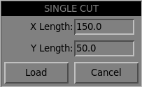

. Jog to the required X/Y start position.
. Set required appropriate material, or edit the Feed Rate for the default material in the <<plasmac2:parameters-page,Parameters Page>>.
. Press the assigned single cut user button.
. Enter the length of the cut along the X and/or Y axes.
. Press the *Load* button and the single cut job will be loaded.

.*_Pendant Single Cut_*
If the machine is equipped with a pendant that can start and stop the spindle plus jog the X and Y axes, the user can manually perform a single cut.

. Jog to the required X/Y start position.
. Set the required feed rate with the Jog Speed slider.
. Start the cut process by starting the spindle.
. After probing the torch will fire.
. When the Arc OK is received the machine can be jogged along the cut line using the jog buttons.
. When the cut is complete stop the spindle.
. The torch will turn off and the Z axis will return to the starting position.

[[plasmac2:manual-single-cut]]
.*_Manual Single Cut_*
Manual single cut requires that either `Use KB Shortcuts` are enabled in the GUI section of the <<plasmac2:setup-page,Setup Page>>,
or a custom user button is specified as a <<plasmac2:button-mancut,manual cut>> button.

If the user is using a custom user button then substitute *F9* with *User Button* in the following description.

. Jog to the required X/Y start position.
. Start the procedure by pressing *F9*. The jog speed will be automatically set to the feed rate of the currently selected material.
. After probing the torch will fire.
. When the Arc OK is received the machine can be jogged along the cut line using the jog keys.
. The Z height will remain locked at the cut height for the duration of the manual cut, regardless of the Torch Height Controller *Enable* status.
. When the cut is complete press *F9*, or *Esc*, or the *Stop* button.
. The torch will turn off and the Z axis will return to the starting position.
. The jog speed will automatically be returned to the value it was prior to initiating the manual cut process.

[NOTE]
If the torch flames out during cutting, the user must still press *F9*, or *Esc*, or the *Stop* button to end the cut.
This clears the Z offsets and returns the torch to the starting position.

[[plasmac2:thick-materials]]
=== Thick Material
Cutting thick materials can be problematic in that the large amount of molten metal caused by piercing can shorten the life of consumables and also may cause a puddle high enough that the torch may hit the puddle while moving to cut height.

The are two functions built into plasmac2 to help alleviate these issues.

[[plasmac2:pierce-only]]
.*_Pierce Only_*
*Pierce Only* mode converts the loaded G-code program and then runs the program to pierce the material at the start position of each cut. Scribe and Spotting commands will be ignored and no pierce will take place in those locations.

This mode is useful for thick materials which may produce enough dross on the material surface from piercing to interfere with the torch while cutting. The entire sheet can pierced and then cleaned off prior to cutting.

It is possible to use near-end-of-life consumables for piercing and then they can be swapped out for good consumables to be used while cutting.

The pierce location during *Pierce Only* mode may be offset in the X and/or Y axes to ensure that the arc is able to transfer correctly when piercing after returning to the *Normal Cut* mode.
The parameters for the X and Y Offsets are in the Pierce Only frame of the <<plasmac2:parameters-page,Parameters Page>>.
*Pierce Only* is one of two different <<plasmac2:cut-types,cut types>>

.*_Puddle Jump_*
`Puddle Jump` is the height that the torch will move to after piercing and prior to moving to `Cut Height` and is expressed as a percentage of `Pierce Height`.
This allows the torch to clear any puddle of molten material tht may be caused by piercing.
The maximum allowable height is 200% of the `Pierce Height`

Settings for `Puddle Jump` are described in <<plasmac2:material,cut parameters>>

The recommended option is to use *Pierce Only* due to it being able to utilise near end of life consumables.

[IMPORTANT]`Puddle Jump` is disabled during `Cut Recovery`.

[[plasmac2:mesh-mode]]
=== Mesh Mode (Expanded Metal Cutting)
plasmac2 is capable of cutting of expand (mesh) metal provided the machine has a pilot arc torch and it is capable of Constant Pilot Arc (CPA) mode.

*Mesh Mode* disables the THC and also ignores a lost Arc OK signal during a cut.
It can be selected by checking the *Mesh Mode* check button in the Cut Panel on the <<plasmac2:main-page,Main Page>>.

If the machine has <<plasmac2:pm_comms,RS485>> communications enabled with a Hypertherm PowerMax plasma cutter, selecting *Mesh Mode* will automatically override the *Cut Mode* for the currently selected material and set it to cut mode 2 (CPA). When *Mesh Mode* is disabled, the *Cut Mode* will be return to the default cut mode for the currently selected material.

It is also possible to start a *Mesh Mode* cut without receiving an Arc OK signal by checking the *Ignore Arc OK* check button in the Cut Panel on the <<plasmac2:main-page,Main Page>>.

Both *Mesh Mode* and *Ignore Arc OK* can be enabled/disabled at any time during a job.

[[plasmac2:ignore-ok]]
=== Ignore Arc OK
*Ignore Arc OK* mode disables the THC, will begin a cut without requiring an Arc OK signal, and will ignore a lost Arc OK signal during a cut.

This mode can be selected by:

. Checking the *Ignore Arc OK* check button in the Cut Panel on the <<plasmac2:main-page,Main Page>>.
. Setting HAL pin `motion.digital-out-01` to 1 via G-code.

* `M62 P1` will enable *Ignore Arc OK* (`Synchronized with Motion`)
* `M63 P1` will disable *Ignore Arc OK* (`Synchronized with Motion`)
* `M64 P1` will enable *Ignore Arc OK* (`Immediate`)
* `M65 P1` will disable *Ignore Arc OK* (`Immediate`)

The <<plasmac2:halpin-setting,HAL Pin Setting>> section of this manual explains the differences between `Synchronized with Motion` and `Immediate`.

This mode may also be used in conjunction with *Mesh Mode* if the user doesn't require an Arc OK signal to begin the cut.

Both *Mesh Mode* and *Ignore Arc OK* can be enabled/disabled at any time during a job.

[[plasmac2:cut-recovery]]
=== Cut Recovery
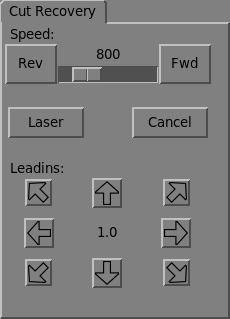

This feature will produce a `Cut Recovery` tab that will allow the torch to be moved away from the cut path during a <<plasmac2:paused-motion,paused motion>> event in order to position the torch over a scrap portion of the material being cut so that the cut restarts with a minimized arc-divot.
The `Cut Recovery` tab will display automatically over top of the JOGGING panel when motion is paused.

It is preferable to make torch position adjustments from the point at which `Paused Motion` occurred, however if moving along the cut path is necessary prior to setting the new start point, the user may use the `Paused Motion` controls (*Rev*, *Fwd*, and a *Jog Speed* slider) at the top of the `Cut Recovery` tab.
Once the user is satisfied with the positioning of the torch along the cut path, moving off the cut path is achieved by pressing the *Direction* buttons.
Each press of the *Direction* button will move the torch a distance equivalent to the `Kerf Width` parameter of the currently selected material.

The moment the torch has been moved off the cut path, the `Paused Motion` controls (*Rev*, *Fwd*, and a *Jog Speed* slider) at the top of the `Cut Recovery` tab will become disabled.

Once the torch position is satisfactory, press *Resume* and the cut will resume from the new position and travel the shortest distance to the original `Paused Motion` location. The `Cut Recovery` tab will close and the JOGGING panel will display when the torch returns to the original `Paused Motion` location.

Pressing *Cancel* will cause the torch to move back to where it was positioned before the direction keys were used to offset the torch.
It will not reset any *Rev* or *Fwd* motion.

Pressing *Stop* will cause the torch to move back to where it was positioned before the direction keys were used to offset the torch and the `Cut Recovery` tab overlay will return to the JOGGING panel.
It will not reset any *Rev* or *Fwd* motion.

If an alignment laser has been set up then it is possible to use the laser during `Cut Recovery` for very accurate positioning of the new start coordinates.
If either the X axis offset or Y axis offset for the laser would cause the machine to move out of bounds then an error message will be displayed.

*To use a laser for cut recovery when paused during a cut:*

. Click the *Laser* button.
. *Laser* button will change to disabled, the HAL pin named axisui.laser_on will be turned on and the X and Y axis will offset so that the laser cross hairs will indicate the starting coordinates of the cut when it is resumed.
. Continue the `Cut Recovery` as described above.

If a laser offset is in effect when *Cancel* is pressed then this offset will also be cleared.

[NOTE]
`Cut Recovery` movements will be limited to a radius of 10mm (0.4") from either the point the program was paused,
or from the last point on the cut path if `Paused Motion` was used.

[IMPORTANT]
Puddle Jump is disabled during `Cut Recovery`.

[[plasmac2:run-from-line]]
=== Run From Line
If the user has the Run From Line option enabled in the GUI SETTINGS section of the <<plasmac2:setup-page,Setup Page>> then they will have the ability to start from any line in a G-code program via the following method:

. Select any line in the Preview Window or the G-code Window by left clicking the line.
. Right click to display the menu.
. Left click *Run from here*

It is important to note that G-code programs can be run from any selected line using this method, however a leadin may not be possible depending on the line selected.
In this case, an error message will be displayed to let the user know the leadin calculation was not possible.

It is not possible to use Run From Line from within a subroutine.
If the user selects a line within a subroutine and attempts to run the resulting file then an error message will be displayed that includes the O-code name of the subroutine.

It is not possible to use Run From Line if previous G-code has set cutter compensation active.
If the user selects a line while cutter compensation is active and attempts to run the resulting file then an error message will be displayed.

It is possible to select a new line while Run From Line is active.

Run From Line may be canceled by clicking the reload button in the toolbar - this method will cancel the Run From Line process if Load was clicked on the Run From Line parameters dialog box and "rfl.ngc" is displayed as the loaded file name in the G-code window header. This will return the user to the originally loaded file.

Once the user has selected the starting place, the Run From Line options dialog box will be displayed.

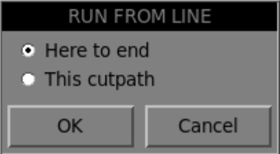

==== Here to end

*Here to end* will run from the beginning of the selected line to the end of the G-code file with the option of adding a leadin.

Once the user has selected *Here to end*, the Run From Line parameters dialog box will be displayed.

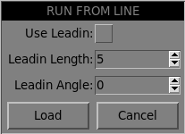

[cols="4,16"]
|===
|*Name*          |*Description*
|_Use Leadin_    |This radio button will allow the user to start the selected line with a leadin.
|_Leadin Length_ |If Use Leadin is selected, this will set the length of the lead in the machine units.
|_Leadin angle_  |If Use Leadin is selected, this will set the angle of approach for the leadin. +
                  The angle is measured such that positive increases in value move the leadin counter-clockwise: +
                  0 Degrees = 3 o'clock position +
                  90 Degrees = 12 o'clock position +
                  180 Degrees = 9 o'clock position +
                  270 Degrees = 6 o'clock position
|_Cancel_        |This button will cancel the Run From Line dialog box and any selections.
|_Load_          |This button will load a temporary "rfl.ngc" program with any selected leadin parameters applied. +
                  If the leadin cannot be calculated for the selected line, the following error message will be displayed: +
                  "Unable to calculate a leadin for this cut +
                  Program will run from selected line with no leadin applied"
|===

After pressing the *Load* button the new cut job will be loaded consisting of all the cutpaths from the selected segment to the end of the original cut job.
Click the *Run* button to start the program from the beginning of the selected line.

==== This cutpath

*This cutpath* will run only the cutpath that the selected segment is a part of.

Once the user has selected *This cutpath*, the new cut job will be loaded consisting of the cutpath that the selected segment was part of.
Click the *Run* button to start the program from the beginning of the selected line.

[[plasmac2:scribe]]
=== Scribe
A scribe may be operated by plasmac2 in addition to the plasma torch.

Using a scribe requires the use of the LinuxCNC tool table. Tool 0 is assigned to the plasma torch and Tool 1 is assigned to the scribe. The scribe X and Y axes offsets from the plasma torch need to be entered into the LinuxCNC tool table. This is done by editing the tool table via the main GUI, or by editing the `tool.tbl` file in the _<machine_name>_ configuration directory. This will be done after the scribe can move to the work piece to help determine the appropriate offset.

The plasma torch offsets for X and Y will always be zero. The tools are selected by the `Tn M6` command followed by a `G43 H0` command which is required to apply the offsets.
The tool is then started with a `M3 $n S1` command. For `n`, use 0 for torch cutting or 1 for scribing.

To stop the scribe, use the G-code command `M5 $1`.

If the user has not yet assigned the HAL pins for the scribe then they may do so by manually editing the HAL file.

There are two HAL output pins used to operate the scribe, the first pin is used to arm the scribe which moves the scribe to the surface of the material.
After the <<plasmac2:scribe-parameter,Arm Delay>> has elapsed, the second pin is used to start the scribe. After the <<plasmac2:scribe-parameter,On Delay>> has elapsed, motion will begin.

Using plasmac2 after enabling the scribe requires the selection of either the torch or the scribe in each G-code file as a LinuxCNC tool.

The first step is to set the offsets for the scribe by following the procedure described in <<plasmac2:peripheral-offsets,Peripheral Offsets>>.

The final step is to set the <<plasmac2:scribe-parameter,scribe delays>> required:

. `Arm Delay` - allows time for the scribe to descend to the surface of the material.
. `On Delay` - allows time for the scribe to start before motion begins.

Save the parameters in the Parameters tab.

After the above directions are completed, the scribe may be tested manually by issuing a `M3 $1 S1` command in the MDI input. The user may find it helpful to use this method to scribe a small divot and then try to pulse the torch in the same location to align the offsets between the scribe and the torch.

To use the scribe from G-code:

[source,{ngc}]
----
...
M52 P1 (allow paused motion`)
F#<_hal[plasmac.cut-feed-rate]>
T1 M6 (select scribe)
G43 H0 (apply offsets for current tool)
M3 $1 S1 (start the scribe)
.
M5 $1 (stop the scribe)
.
T0 M6 (select torch)
G43 H0 (apply offsets for current tool)
G0 X0 Y0 (parking position)
M5 $-1 (end all)
----

It is a good idea to switch back to the torch at the end of the program before the final rapid parking move so the machine is always in the same state at idle.

The user can switch between the torch and the scribe any number of times during a program by using the appropriate G-codes.

Issuing `M3 S1` (without `$n`) will cause the machine to behave as if an `M3 $0 S1` had been issued and issuing `M5` (without `$n`) will cause the machine to behave as if an `M5 $0` had been issued.
This will control the torch firing by default in order to provide backward compatibility for previous G-code files.

[WARNING]
If there is an existing manual tool change parameter set in the _<machine_name>_.hal file then plasmac2 will convert it to an automatic tool change.

[[plasmac2:spotting]]
=== Spotting
To achieve spotting to mark the material prior to drilling etc., plasmac2 can pulse the torch for a short duration to mark the spot to drill.

Spotting can be configured by following these steps:

. Set the arc voltage `Threshold` in the Spotting frame of the <<plasmac2:parameters-page,Parameters Page>>. Setting the voltage `Threshold` to zero will cause the delay timer to begin immediately upon starting the torch. Setting the voltage `Threshold` above zero will cause the delay timer to begin when the arc voltage reaches the `Threshold` voltage.
. Set the `On Delay` in the Spotting frame of the <<plasmac2:parameters-page,Parameters Page>>. When the `On Delay` timer has elapsed, the torch will turn off. Times are adjustable from 0 to 9999 milliseconds.

The torch is then turned on in G-code with the `M3 $2 S1` command which selects the plasma torch as a spotting tool.

To turn the torch off, use the G-code command `M5 $2`.

For more information on multiple tools, see <<plasmac2:multi-tool,multiple tools>>.

LinuxCNC (plasmac2) requires some motion between any `M3` and `M5` commands.
For this reason, a minimal movement at a high speed is required to be programmed.

An example G-code is:

[source,{ngc}]
----
G21 (metric)
F99999 (high feed rate)
.
.
G0 X10 Y10
M3 $2 S1 (spotting on)
G91 (relative distance mode)
G1 X0.000001
G90 (absolute distance mode)
M5 $2 (spotting off)
.
.
G0 X0 Y0
G90
M2
----

[NOTE]
The high feed rate of 99999 is to ensure that the motion is at the machine's highest feed rate.

[IMPORTANT]
Some plasma cutters will not be suitable for this feature. +
 +
It is recommended that the user carry out some test spotting to ensure that the plasma cutter is capable of utilizing this feature.

[[plasmac2:tube_cutting]]
=== Tube Cutting

Tube cutting with an angular A, B, or C axis is achieved with the following in the G-code file:

- #<tube_cut>=1 magic comment before any motion command.
- All material probing must be done using the link:../gcode/g-code.html#gcode:g38[G38] straight probe codes.
- All Z axis motion is required, plasmac does no internal Z axis motion during tube cutting.
- PIERCE_DELAY is the only required <<plasmac2:material-handling,material parameter>>
- Start a cut with M3 $0 S1.
- End a cut with M5 $0

[[plasmac2:custom_kb_layouts]]
=== Virtual Keyboard Custom Layouts
Virtual keyboard support is available for only the "onboard" onscreen keyboard. If it is not already on the system it may be installed by typing the following in a terminal:

----
sudo apt install onboard
----

The following two custom layouts are used for soft key support:

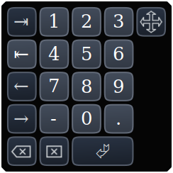

image::images/plasmac2_keypad.png[caption="", title="Alpha-numeric keypad - used for G-code editing and file management.",width=700,align="center"]

If the virtual keyboard has been repositioned and on the next opening of a virtual keyboard it is not visible then clicking twice on the onboard icon in the system tray will reposition the virtual keyboard so the move handle is visible.

== Error Messages
=== Error Message Display
By default, plasmac2 will display error messages via a popup window in the lower right corner of the GUI window.

=== Critical Errors
There are a number of error messages printed by plasmac2 to inform the user of faults as they occur. The messages can be split into two groups, *Critical* and *Warning*.

Critical Errors will cause the running program to pause, and the operator will need to clear the cause of the error before proceeding.

If the error was received during cutting then forward or reverse motion is allowed while the machine is paused to enable the user to reposition the machine prior to resuming the cut.

When the error is cleared the program may be resumed.

These errors indicate the corresponding sensor was activated during cutting:

* *breakaway switch activated, program is paused*
* *float switch activated, program is paused*
* *ohmic probe activated, program is paused*

These errors indicate the corresponding sensor was activated before probing commenced:

* *ohmic probe detected before probing program is paused*
* *float switch detected before probing program is paused*
* *breakaway switch detected before probing program is paused*

The Arc OK signal was lost during cutting motion, before the *M5* command was reached:

* *valid arc lost program is paused*

The Z axis reached the bottom limit before the work piece was detected:

* *bottom limit reached while probing down program is paused*

The work piece is too high for any safe rapid removes:

* *material too high for safe traverse, program is paused*

One of these values in  |Material frame of the <<plasmac2:main-page, Main Page>> is invalid (For example: if they are set to zero):

* *invalid pierce height or invalid cut height or invalid cut volts, program is paused*

No arc has been detected after attempting to start the number of times indicated by *Max Starts* in the ARC frame of the CONFIGURATION section of the <<plasmac2:parameters-page,Parameters Page>>:

* *no arc detected after __<n>__d start attempts program is paused*
* *no arc detected after __<n>__d start attempts manual cut is stopped*

THC has caused the bottom limit to be reached while cutting:

* *bottom limit reached while THC moving down program is paused*

THC has caused the top limit to be reached while cutting:

* *top limit reached while THC moving up program is paused*

These errors indicate move to pierce height would exceed the Z Axis MAX_LIMIT for the corresponding probe method:

* *pierce height would exceed Z axis maximum limit condition found while moving to probe height during float switch probing*
* *pierce height would exceed Z axis maximum limit condition found while moving to probe height during ohmic probing*

These errors indicate the move to pierce height would exceed the Z axis maximum safe height for the corresponding probe method:

* *pierce height would exceed Z axis maximum safe height condition found while float switch probing*
* *pierce height would exceed Z axis maximum safe height condition found while ohmic probing*

=== Warning Messages
Warning messages will not pause a running program and are informational only.

These messages indicate the corresponding sensor was activated before a probe test commenced:

* *ohmic probe detected before probing probe test aborted*
* *float switch detected before probing probe test aborted*
* *breakaway switch detected before probing probe test aborted*

This indicates that the corresponding sensor was activated during a consumable change:

* *breakaway, float, or ohmic activated during consumable change, motion is paused* +
  *WARNING: MOTION WILL RESUME IMMEDIATELY UPON RESOLVING THIS CONDITION!*

[WARNING]
Consumable Change motion will resume immediately upon resolving the corresponding sensor activation.

This indicates that the corresponding sensor was activated during probe testing:

* *breakaway switch detected during probe test*

This indicates that probe contact was lost before probing up to find the zero point:

* *probe trip error while probing*

This indicates that the bottom limit was reached during a probe test:

* *bottom limit reached while probe testing*

This indicates that the move to pierce height would exceed the Z Axis MAX_LIMIT during the corresponding probe method:

* *pierce height would exceed Z axis maximum limit condition found while moving to probe height during float switch probe testing*
* *pierce height would exceed Z axis maximum limit condition found while moving to probe height during ohmic probe testing*

This indicates that the safe height has been reduced due to THC raising the Z axis during cutting:

* *safe traverse height has been reduced*

This indicates that the value for the Arc Voltage was invalid (NAN or INF) when plasmac2 launched.

* *invalid arc-voltage-in*

[[plasmac2:update]]
== Updating plasmac2
=== Standard Update
plasmac2 update notices are posted on https://forum.linuxcnc.org/plasmac/37233-plasmac-updates[this thread] on the LinuxCNC forum.

*Users are strongly encouraged to create a Username and subscribe to the above thread to receive update notices.*

plasmac2 configurations will be updated at the same rate as the type of LinuxCNC installation.

- For package installation from Debian it will be whenever the LinuxCNC packge is update in the Debian repository.
- For package installation from the Buildbot it will be each time the Buildbot completes a build after a commit was detected.
- For run in place installation it will be each time a change is committed.

For a package installation the user will need to retrive the updates by running th following from a terminal:

----
sudo apt update
sudo apt dist-upgrade
----

For a run in place installation the user will need to retrive the updates by running th following from a terminal:

----
cd ~/linuxcnc-dev/src
git pull
make
sudo make setuid
----

== Modify An Existing plasmac2 Configuration
There are two ways to modify an existing plasmac2 configuration:

. Running the appropriate http://linuxcnc.org/docs/devel/html/plasma/qtplasmac.html#configuring[configuration wizard] and loading the .stepconf or .pncconffile saved by the wizard.
. Manually edit the INI and/or the HAL file of the configuration.

[IMPORTANT]
Any manual modification to the _<machine_name>_.ini and _<machine_name>_.hal files will not be registered in PnCconf or StepConf.

[NOTE]
If unsure of the HAL pin's full name, the user may start LinuxCNC and run *HalShow* for a full listing of all HAL pins.

== Customizing the plasmac2 GUI
=== Custom Python Code
It is possible to add custom Python code to change some existing functions or to add new ones.
It is also possible to add custom HAL pins to the HAL component `axisui` that can be manipulated by the custom python code.

Custom python code can be added in to two different files that are provided in the configuration directory and custom HAL pins can be created in one file provided in the configuration directory.

All of these files have simple examples that have been commented so they do not execute.

.Custom Files
[cols="4,16"]
|===
|*Name*             |*Function*
|_user_commands.py_ |Called once at startup
|_user_periodic.py_ |Called every cycle (default is every 100mS)
|_user_hal.py_      |Called once at startup
|===

== plasmac2 Advanced Topics
[[plasmac2:user-buttons]]
=== Custom User Buttons
The plasmac2 GUI offers user buttons that can be customized by adding commands in the <<plasmac2:user_button_entry,User Button Entry>> section of the <<plasmac2:setup-page,Setup Page>> in the _<machine_name>_.prefs file.

There are a maximum of 20 user buttons available and the user will need to run plasmac2 at the desired screen size to determine how many user buttons are available for use.

All _<machine_name>_.prefs file settings for the buttons are found in the *[BUTTONS]* section.

==== Button Names
The text that appears on the button is set the following way:

[source,{ini}]
----
n Name = HAL Show
----

Where `n` is the button number and `HAL Show` is the text.

For text on multiple lines, split the text with a `\` (backslash) which will increase the height of the button by one line per `\`:

[source,{ini}]
----
n Name = HAL\Show
----

==== Button Code
Buttons can run the following functions:

. <<plasmac2:button-cmds,External commands>>
. <<plasmac2:button-py,External python scripts>>
. <<plasmac2:button-code,G-code commands>>
. <<plasmac2:button-dual,Dual code>>
. <<plasmac2:button-toggle,Toggle a HAL pin>>
. <<plasmac2:button-laser,Toggle the alignment laser HAL pin>>
. <<plasmac2:button-pulse,Pulse a HAL pin>>
. <<plasmac2:button-probe,Probe test>>
. <<plasmac2:button-ohmic,Ohmic Test>>
. <<plasmac2:button-cut,Cut Type>>
. <<plasmac2:button-consumables,Change consumables>>
. <<plasmac2:button-load,Load a G-code program>>
. <<plasmac2:button-torch,Pulse the torch on>>
. <<plasmac2:button-single,Single unidirectional cut>>
. <<plasmac2:button-framing,Framing a job>>
. <<plasmac2:button-mancut,Begin/End a manual cut>>
. <<plasmac2:button-latest,Load the latest modified NGC file found in a directory>>

[[plasmac2:button-cmds]]
==== External Commands
To run an external command, the command is preceded by a `%` character.

[source,{ini}]
----
n Code = %halshow
----

[[plasmac2:button-py]]
==== External Python Scripts
To run an external Python script, the script name is preceded by a `%` character and it also requires a `.py` extension.
It is valid to use the ~ character as a shortcut for the users home directory.

[source,{ini}]
----
n Code = %halshow
----

[[plasmac2:button-code]]
==== G-code
To run G-code, just enter the code to be run.

[source,{ini}]
----
n Code = G0 X100
----

To run an existing subroutine.

[source,{ini}]
----
n Code = o<the_subroutine> call
----

_<machine_name>_.ini file options can be entered by using the standard LinuxCNC G-code format.
If expressions are included then they need to be surrounded by brackets.

[source,{ini}]
----
n Code = G0 X#<_ini[joint_0]home> Y1
n Code = G53 G0 Z[#<_ini[axis_z]max_limit> - 1.001]
----

_<machine_name>_.prefs file options and _<machine_name>_.ini file options can be also entered by enclosing in braces.
If expressions are included then they need to be surrounded by brackets.

[source,{ini}]
----
n Code = G0 X{LASER_OFFSET X axis} Y[{LASER_OFFSET Y axis} + 3]
n Code = G53 G0[{ZAXIS_Z MAX_LIMIT} - 1.001]
----

Multiple codes can be run by separating the codes with a "\" (backslash) character.
The exception is the special commands which are required to be a single command per button.

[source,{ini}]
----
n Code = G0 X0 Y0 \ G1 X5 \ G1 Y5
----

External commands and G-code may be mixed on the same button.

[source,{ini}]
----
n Code = %halshow \ g0x.5y.5 \ %halmeter
----

[[plasmac2:button-dual]]
.*Dual Code*

Dual Code allows the running of two code snippets alternately each button press.
The button text may also alternate each button press and the indicator light may be optionally enabled.

It is mandatory to specify "dual-code", the first code, the alternate button text, and the second code separated by double semicolons.
If the indicator is required then optionally add ";; true" at the end.

[source,{ini}]
----
n Code = dual-code ;; code1 ;; name1 ;; code2 ;; true
----

On the first button press, code1 will be run, the button text will change to name1, and if "true" is specified the indicator will light.

On the second button press, code2 will be run, the button text will change to n Name, and the indicator will extinguish if lit.

code1 and code2 both follow the rule of the preceding code explanations, <<plasmac2:button-cmds,External commands>>, <<plasmac2:button-py,Python code>>, and <<plasmac:button-code,G-code>>. Multiple codes as well as mixing codes are allowed.

The following code will allow the user to use a single button to run two code snippets alternately each button press:

[source,{ini}]
----
n Name = X+10
n Code = dual-code ;; G91\G0X10\G90 ;; X-10 ;; G91\G0X-10\G90
----

The original label will be X+10, when pressed the torch will move positive 10 in the X axis and the label will change to X-10.
When pressed again the torch will move negative 10 in the X axis and the label will change to X+10.

[[plasmac2:button-toggle]]
==== Toggle HAL Pin
The following code will allow the user to use a button to invert the current state of a HAL bit pin:

[source,{ini}]
----
n Code = toggle-halpin the-hal-pin-name
----

This code is required to be used as a single command and may only control one HAL bit pin per button.

The button colors will follow the state of the HAL pin.

After setting the code, upon clicking, the button will invert colors and the HAL pin will invert pin state.
The button will stay "latched" until the button is clicked again, which will return the button to the original colors and the HAL pin to the original pin state.

It is possible for the user to mark the associated HAL pin as being required to be turned "ON" before starting a cut cycle by adding `runcritical` or `cutcritical` after the HAL pin in the button code. If *TORCH ENABLE* is checked and *Run* is pressed while the `runcritical` button is not "ON" then the user will receive a dialog warning them as such and asking to Continue or Cancel.

[source,{ini}]
----
n Code = toggle-halpin the-hal-pin-name runcritical
----

It is also possible for the user to specify alternate text which will display on the button while ever it is in the latched on condition.
To specify the alternate text, use a double semicolon followed by the required text. This must be the last item in the button code.

[source,{ini}]
----
n Code = toggle-halpin the-hal-pin-name ;; HALPIN\TOGGLED
----

If alternate text as described above is required on a runcritical button then a code example would be:

[source,{ini}]
----
n Code = toggle-halpin the-hal-pin-name runcritical ;; HALPIN\TOGGLED
----

There are three <<plasmac2:ext-hal-pin,External HAL Pins>> that are available to toggle as an output,
the pin names are `axisui.ext.out_0`, `axisui.ext.out_1`, and `axisui.ext.out_2`.
HAL connections to these HAL pins need to be specified in a postgui HAL file as the HAL pins are not available until the AXIS GUI has loaded.

[[plasmac2:button-pulse]]
==== Pulse HAL Pin
The following code will allow the user to use a button to pulse a HAL bit pin for a duration of 0.5 seconds:

[source,{ini}]
----
n Code = pulse-halpin the-hal-pin-name 0.5
----

This code is required to be used as a single command and may only control one HAL bit pin per button.

The pulse duration is specified in seconds, if the pulse duration is not specified then it will default to one second.

The button colors will follow the state of the HAL pin.

After setting the code, upon clicking the button, the button will invert colors, the HAL pin will invert pin state, and the time remaining will be displayed on the button.
The button color and the pin state will stay inverted until the pulse duration timer has completed, which will return the button to the original colors, the HAL pin to the original pin state, and the original button name.

An active pulse can be canceled by clicking the button again.

There are three <<plasmac2:ext-hal-pin,External HAL Pins>> that are available to pulse as an output, the pin names are `axisui.ext.out_0`, `axisui.ext.out_1`, and `axisui.ext.out_2`.
HAL connections to these HAL pins need to be specified in a postgui HAL file as the HAL pins are not available until the AXIS GUI has loaded.

[[plasmac2:button-probe]]
==== Probe Test
plasmac2 will begin a probe and when the material is detected, the Z axis will rise to the `Pierce Height` currently displayed in the  |Material frame of the <<plasmac2:main-page, Main Page>>.

plasmac2 will then wait in this state for the time specified (rounded to no decimal places) before returning the Z axis to the starting position.
An example of a 6 second delay is below. If there is no time specified then the probe time will default to 10 seconds.

[source,{ini}]
----
n Code = probe-test 6
----

[NOTE]
Enabling a user button as a Probe Test button will enable an <<plasmac2:ext-hal-pin,external HAL pin>> that may be connected from a pendant etc. HAL connections to this HAL pin needs to be specified in a postgui HAL file as the HAL pin is not available until the AXIS GUI has loaded.

[[plasmac2:button-ohmic]]
==== Ohmic Test
plasmac2 will enable the Ohmic Probe Enable output signal and if the Ohmic Probe input is sensed, the LED indicator in the SENSOR Panel will light.
The main purpose of this is to allow a quick test for a shorted torch tip.

[source,{ini}]
----
n Code = ohmic-test
----

[[plasmac2:button-cut]]
==== Cut Type
This button if selected will toggle between the two <<plasmac2:cut-types,cut types>>, *Normal Cut* (default cutting mode) or *Pierce Only*.

[source,{ini}]
----
n Code = cut-type
----

[[plasmac2:button-consumables]]
==== Change Consumables
Pressing this button moves the torch to the specified coordinates when the machine is paused to allow the user easy access to change the torch consumables.

Valid entries are `Xnnn` `Ynnn` `Fnnn`. Feed Rate (F) is mandatory and at least one of the X or Y coordinates are required.

The X and Y coordinates are in absolute machine coordinates. If X or Y are missing then the current coordinate for that axis will be used.

There are three methods to return to the previous coordinates:

. Press the *Change Consumables* button again - the torch will return to the original coordinates and the machine will wait in this position for the user to resume the program.
. Press *Resume* - the torch will return to the original coordinates and the program will resume.
. Press *Stop* - the torch will return to the original coordinates and the program will abort.

[source,{ini}]
----
n Code = change-consumables X10 Y10 F1000
----

[[plasmac2:button-load]]
==== Load
Loading a G-code program from the directory specified by the `PROGRAM_PREFIX` variable in the _<machine_name>_.ini file (usually ~/linuxcnc/nc_files) is possible by using the following format:

[source,{ini}]
----
n Code = load G-code.ngc
----

If the user's G-code file is located in a sub-directory of the `PROGRAM_PREFIX` directory, it would be accessed by adding the sub-directory name to the beginning of the G-code file name.
Example for a sub-directory named *plasma*:

[source,{ini}]
----
n Code = load plasma/G-code.ngc
----

Note that the first `/` is not necessary as it will be added automatically.

[[plasmac2:button-torch]]
==== Torch Pulse
Pulse the torch on for a predetermined time.
The time must be specified in seconds using up to one decimal place.
The maximum allowable time is 3 seconds, anything specified above that value will be limited to 3 seconds.
An example of a 0.5 second pulse is below.
It there is no time specified then it will default to 1 second.
Pulse times with more than one decimal place will be rounded to one decimal place.

Pressing the button again during the countdown will cause the torch to be turned off,
as will pressing 'Esc' if keyboard shortcuts are enabled in the <<plasmac2:setup-page,Setup Page>>.

If the button is released before the countdown is complete then the torch will turn off at countdown completion,
holding the button on until after the countdown has completed will cause the torch to remain on until the button has been released.

[source,{ini}]
----
n Code = torch-pulse 0.5
----

[NOTE]
Enabling a user button as a Torch Pulse button will enable an <<plasmac2:ext-hal-pin,external HAL pin>> that may be connected from a pendant etc. +
HAL connections to this HAL pin need to be specified in a postgui HAL file as the HAL pin is not available until the AXIS GUI has loaded.

[[plasmac2:button-single]]
==== Single Cut
Run a single unidirectional cut. This utilises the automatic <<plasmac2:single-cut,Single Cut>> feature.

[source,{ini}]
----
n Code = single-cut
----

[[plasmac2:button-framing]]
==== Framing
Framing is the ability to move the torch around the perimeter of a rectangle that encompasses the bounds of the current job.

The laser enable HAL pin (axisui.laser_on) will be turned on during the framing moves
and any X/Y offsets for the laser pointer in the _<machine_name>_.prefs file will also be applied to the X/Y motion.
After the framing motion is completed,
the torch will move to the X0 Y0 position to clear any applied laser offsets and axisui.laser_on will be turned off.

Upon starting a Framing cycle,
it is important to note that by default the Z axis will be moved to a height of [AXIS_Z]MAX_LIMIT - 5mm (0.2") before X/Y motion begins.

The velocity for the XY movements of the Framing motion can be specified so that Framing motion always occurs at a set velocity.
This can be achieved by adding the feed rate (F) as the as the last portion of the button code.
If the feed rate is omitted from the button code, framing motion velocity will default to the feed rate for the currently selected material.

The following GUI buttons and Keyboard Shortcuts (if enabled in the <<plasmac2:setup-page,Setup Page>>) are valid during Framing motion:

. Pressing *Stop* or the ESC key - Stops Framing motion.
. Pressing *Pause* or the SPACE BAR - Pauses Framing motion.
. Pressing *Resume* or the CTRL+r keys- Resumes paused Framing motion.
. Changing the *Feed Slider* or any of the CTRL+0-9 keys - Slows the feed rate.

[NOTE]
If the feed rate is changed for the framing motion, it will be necessary to return the feed slider to 100% before pressing cycle start and cutting the loaded job.

[source,{ini}]
----
n Code = framing
----

It is possible for the user to omit the initial default Z movement and run the framing sequence at the current Z height by adding `usecurrentzheight` after `framing`.

[source,{ini}]
----
n Code = framing usecurrentzheight
----

To specify a feed rate:

[source,{ini}]
----
n Code = framing F100
----

or:

[source,{ini}]
----
n Code = framing usecurrentzheight F100
----

Enabling a user button as a framing button will enable an <<plasmac2:ext-hal-pin,external HAL pin>> that may be connected from a pendant etc.
HAL connections to this HAL pin needs to be specified in a postgui HAL file as the HAL pin is not available until the AXIS GUI has loaded.

[[plasmac2:button-mancut]]
==== Manual Cut
Manual Cut functions identically to the *F9* button to begin or end a <<plasmac2:manual-single-cut,manual cut>>.

[source,{ini}]
----
n Code = manual-cut
----

[[plasmac2:button-latest]]
==== Load Latest File
This allows the loading of the last modified file in a directory.
The directory name is optional and if omitted will default to the last directory a file was loaded from.

[source,{ini}]
----
n Code = latest-file /home/me/linuxcnc/nc_files/plasmac2-test
----

[[plasmac2:peripheral-offsets]]
=== Peripheral Offsets (Laser, Scribe, Offset Probe)
Use the following sequence to set the offsets for a laser, scribe, or offset probe:

- The machine must be homed and idle before proceeding.
- Open the <<plasmac2:setup-page,Setup Page>>.
- Click the *Peripheral Offsets* button which opens the Set Peripheral Offsets dialog.
 
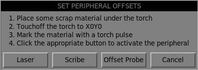

. Place a piece of scrap material under the torch.
. Click the X0Y0 button to set the torch position to zero.
. Make a mark on the material by one of:
.. Jog the torch down to pierce height then pulse the torch on to make a dimple in the material.
.. Place marking dye on the torch shield then jog the torch down to mark the material.
. Click the appropriate button to activate the peripheral.

The appropriate Set Peripheral Offsets dialog will now be showing.

. Jog the X/Y axes so that the peripheral is centered in the mark from the torch.
. Click the *Yes* button to get the offsets and a confirmation dialog will open.

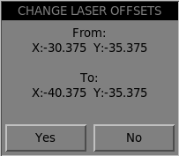
. Click *Yes* and the offsets will now be saved.

Canceling may be done at any stage by pressing the *No* button which will close the dialog and no changes will be saved.

If Offset Probe was selected as the peripheral above then a delay dialog will show prior to the confirmation dialog.
This is for the delay required for the probe to deploy to its working position.

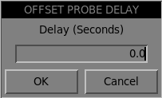

[NOTE]
It may be necessary to click the preview window to enable jogging. +
By following the above procedure the offsets are available for use immediately and no restart of LinuxCNC is required.

=== Keep Z Motion
By default, plasmac2 will remove all Z motion from a loaded G-code file and add an initial Z movement to bring the torch near the top of travel at the beginning of the file.
If the user wishes to use their table with a marker, a drag knife, diamond scribe, etc. mounted in the torch holder,
plasmac2 has the ability to retain the Z movements when executing a program by adding the following command in a G-code file:

[source,{ngc}]
----
#<keep-z-motion> = 1
----

Omitting this command, or setting this value to anything but 1 will cause plasmac2 to revert to the default behavior of stripping all Z motion from a loaded G-code file
and making an initial Z movement to bring the torch near the top of travel at the beginning of the file.

[[plasmac2:ext-hal-pin]]
=== External HAL Pins
plasmac2 creates some HAL pins that may be used to connect a momentary external button or pendant etc.

HAL connections to these HAL pins need to be specified in a postgui HAL file as the HAL pins are not available until the AXIS GUI has loaded.

The following HAL bit pins are always created. The HAL pin has the identical behaviour of the related plasmac2 GUI button.

[cols="3,2,3"]
|===
|*User Button Function*                       |*HAL Pin*              |*GUI Function*
|_Toggle machine power_                       |`axisui.ext.power`     |Power
|_Run the loaded G-code program_              |`axisui.ext.run`       |Run
|_Pause/Resume the loaded G-code program_     |`axisui.ext.pause`     |Pause/Resume
|_Abort the loaded G-code program_            |`axisui.ext.abort`     |Stop
|_Touchoff X & Y axes to zero_                |`axisui.ext.touchoff`  |X0Y0
|_Run/Pause/Resume the loaded G-code program_ |`axisui.ext.run-pause` |Run, Pause, Resume in sequence
|===

The following HAL bit pins are only created if the function is specified in a <<plasmac2:user-buttons,custom user button>>.
The HAL pin has the identical behaviour of the related custom user button.

[cols="3,5"]
|===
|*User Button Function* |*HAL Pin*
|_Probe Test_           |axisui.ext.probe
|_Torch Pulse_          |axisui.ext.pulse
|_Framing_              |axisui.ext.framejob
|===

The following HAL bit output pins are always created and can be used by either the <<plasmac2:button-toggle,Toggle HAL Pin>> or <<plasmac2:button-pulse,Pulse HAL Pin>> custom user buttons to change the state of an output.

[cols="3,5"]
|===
|*HAL Pin* |*Function*
|_axisui.ext.out_0_ |For connecting to other hal pins
|_axisui.ext.out_1_ |For connecting to other hal pins
|_axisui.ext.out_2_ |For connecting to other hal pins
|===

[[plasmac2:mode0-arcok]]
=== Tuning Mode 0 Arc OK
Mode 0 Arc OK relies on the arc voltage to set the Arc OK signal.
This is accomplished by sampling the arc voltage every servo thread cycle.
There needs to be a specified number of consecutive samples, all within a specified threshold for the Arc OK signal to be set.
These voltages are also required to be within a specified range.

There are two settings in the `Arc` frame of the <<plasmac2:parameters-page,Parameters Page>> for setting the range, these are:

- `OK High Volts` which is the upper value of the voltage range. The default is 250V.

- `OK Low Volts` which is the lower value of the voltage range. The default is 60V.

Both of these values may be changed by direct entry or by the use of the increment/decrement buttons.

There are also two HAL pins that have been provided to allow the user to tune the set point. These HAL pins are:

- `plasmac.arc-ok-counts` which is the number of consecutive readings within the threshold that are required to set the Arc OK signal. The default is 10.

- `plasmac.arc-ok-threshold` which is the maximum voltage deviation that is allowed for a valid voltage to set the Arc OK signal. The default is 10.

The following example would set the number of valid consecutive readings required to 6:

[source,{hal}]
----
setp plasmac.arc-ok-counts 6
----

These settings if used should be in the `custom.hal` file of the configuration.

=== Lost Arc Delay
Some plasma power sources/machine configurations may lose the Arc OK signal either momentarily during a cut, or permanently near the end of a cut causing plasmac2 to pause the program and report a "valid arc lost" error.

There is a HAL pin named `plasmac.arc-lost-delay` that may be used to set a delay (in seconds) that will prevent a paused program/error if the lost Arc OK signal is regained, or the `M5` command is reached before the set delay period expires.

It is important to note that the THC will be disabled and locked at the cutting height at the time the Arc OK signal was lost.

The following code would set a delay of 0.1 seconds:

[source,{hal}]
----
setp plasmac.arc-lost-delay 0.1
----

It is recommended that the user set this pin in the `custom.hal` file.

This setting should only be used if the user experiences the above symptoms.
It should also be noted that the user could use the appropriate <<plasmac2:ignore-ok,Ignore Arc OK>> G-code commands to achieve a similar result.

=== Zero Window
Small fluctuations in the arc voltage displayed while the machine is at idle are possible depending on many different variables (electrical noise, incorrect THCAD tuning, etc.).

After all contributing factors have been mitigated, if a small fluctuation still exists it is possible to eliminate it by widening the voltage window for which plasmac2 will display 0V.

The pin for adjusting this value is named `plasmac.zero-window` and the default value is set to 0.1. To change this value, add the pin and the required value to the `custom.hal` file.

The following example would set the voltage window to be displayed as 0V from -5V to +5V:

[source,{hal}]
----
setp plasmac.zero-window 5
----

=== Tuning Void Sensing
In addition to the `Void Slope` setting in the `THC` frame of the <<plasmac2:parameters-page,Parameters Page>> there are two HAL pins to aid in the fine tuning of void anti-dive.
These HAL pins are:

- `plasmac.void-on-cycles` which is the number of times the slope rate needs to be exceeded to activate void anti-dive. The default is 2.
- `plasmac.void-off-cycles` which is the number of cycles without the slope rate being exceeded to deactivate void anti-dive. The default is 10.

The following example would set the number of on cycles required to 3:

[source,{hal}]
----
setp plasmac.void-on-cycles 3
----

The objective is to have as low a value of `Void Slope` as possible without any false triggering then adjust on and off cycles to ensure clean activation and deactivation of void anti-dive.
In most cases it should not be necessary to change on and off cycles from the default value.

These settings if used should be in the `custom.hal` file of the configuration.

=== Max Offset
Max Offset is the distance (in millimeters) away from the Z MAX_LIMIT that plasmac2 will allow the Z axis to travel while under machine control.

The pin for adjusting this value is named `plasmac.max-offset` and the default value (in millimeters) is set to 5.
To change this value, add the pin and the required value to the `custom.hal` file.
It is not recommended to use values less than 5mm as offset overrun may cause unforeseen issues.

The following example would set the distance from Z MAX_LIMIT to 10mm:

[source,{hal}]
----
setp plasmac.max-offset 10
----

=== plasmac State Outputs
The plasmac HAL component has a HAL pin named `plasmac.state-out` which can be used to interface with user-coded components to provide the current state of the component.

.Different states plasmac2 could encounter
[cols="1,4,12"]
|===
|*State* |*Name*                  |*Description*
|_0_     |`IDLE`                  |idle and waiting for a start command
|_1_     |`PROBE_HEIGHT`          |move down to probe height
|_2_     |`PROBE_DOWN`            |probe down until material sensed
|_3_     |`PROBE_UP`              |probe up until material not sensed, this sets the zero height
|_4_     |`ZERO_HEIGHT`           |not used at present
|_5_     |`PIERCE_HEIGHT`         |move up to pierce height
|_6_     |`TORCH_ON`              |turn the torch on
|_7_     |`ARC_OK`                |wait until arc ok detected
|_8_     |`PIERCE_DELAY`          |wait for pierce delay time
|_9_     |`PUDDLE_JUMP`           |xy motion begins, move to puddle jump height
|_10_    |`CUT_HEIGHT`            |move to cut height
|_11_    |`CUT_MODE_01`           |cutting in either mode 0 or mode 1
|_12_    |`CUT_MODE_2`            |cutting in mode 2
|_13_    |`PAUSE_AT_END`          |pause motion at end of cut
|_14_    |`SAFE_HEIGHT`           |move to safe height
|_15_    |`MAX_HEIGHT`            |move to maximum height
|_16_    |`END_CUT`               |end the current cut
|_17_    |`END_JOB`               |end the current job
|_18_    |`TORCHPULSE`            |a torch pulse is active
|_19_    |`PAUSED_MOTION`         |cut recovery motion is active while paused
|_20_    |`OHMIC_TEST`            |an ohmic test is active
|_21_    |`PROBE_TEST`            |a probe test is active
|_22_    |`SCRIBING`              |a scribing job is active
|_23_    |`CONSUMABLE_CHANGE_ON`  |move to consumable change coordinates
|_24_    |`CONSUMABLE_CHANGE_OFF` |return from consumable change coordinates
|_25_    |`CUT_RECOVERY_ON`       |cut recovery is active
|_26 _   |`CUT_RECOVERY_OFF`      |cut recovery is deactivated
|_27_    |`DEBUG`
|===

The DEBUG state is for testing purposes only and will not normally be encountered.

=== plasmac Debug Print
The plasmac HAL component has a HAL pin named `plasmac.debug-print` which if set to 1 (true) will print to terminal every state change as a debug aid.

[[plasmac2:pm_comms]]
=== Hypertherm PowerMax Communications
Communications can be established with a Hypertherm PowerMax plasma cutter that has a RS485 port.
This feature enables the setting of `Cut Mode`, `Cut Amps` and `Gas Pressure` automatically from the `Cut Parameters` of the material file.
In addition, the user will be able to view the PowerMax's `Arc On Time` in hh:mm:ss format on the <<plasmac2:statistics-tab,Statistics Tab>>.

If `Gas Pressure` is set to Zero then the PowerMax will automatically calculate the required pressure from the `Cut Mode`, `Cut Amps`, torch type, and torch length.

Changing the cutting mode will set the `Gas Pressure` to zero causing the machine to use its automatic `Gas Pressure` mode.

The maximum and minimum values of these parameters are read from the plasma cutter and the related spin-buttons in the Cut Parameters are then limited by these values.
`Gas Pressure` cannot be changed from zero until communications have been established.

This feature is enabled by setting the correct port name for the `PM_PORT` option in the `[POWERMAX]` section of the _<machine_name>_.prefs file.
If the `PM_PORT` option is not set in the _<machine_name>_.prefs file then the widgets associated with this feature will not be visible.

Example showing enabling the Hypertherm PowerMax Communications on USB0:

[source,{ini}]
----
[POWERMAX]
Port = /dev/ttyusb0
----

If the user is unsure of the name of the port, there is a Python script in the configuration directory
that will show all available ports and can also be used to test communications with the plasma unit prior to enabling this feature in the plasmac2 GUI.

To use the test script follow these instructions:

For a package installation (Buildbot) enter the following command in a terminal window:
----
pmx485-test
----

For a run in place installation enter the following two commands in a terminal window:
----
source ~/linuxcnc-dev/scripts/rip-environment
pmx485-test
----

The `Gas Pressure` units display (psi or bar) is determined by the data received during initial setup of the communication link
and is then shown next to the `Gas Pressure` setting in the Material frame of the <<plasmac2:main-page, Main Page>>.

The PowerMax machine will go into remote mode after communications have been established and may only be controlled remotely (via the plasmac2 GUI) at this point.
The connection can be validated by observing the PowerMax display.

To switch the PowerMax back to local mode the user can either:

. Disable PowerMax Comms from the <<plasmac2:main-page, Main Page>>
. Close LinuxCNC which will put the PowerMax into local mode during shutdown.
. Turn the PowerMax off for 30 seconds and then power it back on.

TIP: If PowerMax communications is active then selecting <<plasmac2:mesh-mode,Mesh Mode>> will automatically select CPA mode on the PowerMax unit.

[NOTE]
To use the PowerMax communications feature it is necessary to have the Python pyserial module installed. +
If pyserial is not installed an error message will be displayed.

To install pyserial, enter the following command into a terminal window:
----
sudo apt install python3-serial
----

A typical connection diagram is shown in the appendix of the http://linuxcnc.org/docs/devel/html/plasma/qtplasmac.html#plasma:rs485_connections[QtPlasmac User Manaul].

== Appendix
=== Example Configurations
There are example configuration files which use the plasmac2 GUI to simulate plasma cutting machines.

They can be found in the LinuxCNC chooser under: `Sample Configurations` -> `sim` -> `axis` -> `plasma`

There is both a metric units and a imperial units sim config.

Each sample configuration includes a popup control panel to simulate various inputs to the GUI such as:

. ARC VOLTAGE
. OHMIC SENSE
. FLOAT SWITCH
. BREAKAWAY SWITCH
. ESTOP

=== G-code Samples
There are some sample G-code files in the `~/linuxcnc/nc_files/examples/plasmac directory`.

=== plasmac Specific G-codes
[cols="1,2"]
|===
|*Description*                                                          |*Code*
|_Begin <<plasmac2:multi-tool,cut>>_                                    |`M3 $0 S1`
|_End <<plasmac2:multi-tool,cut>>_                                      |`M5 $0`
|_Begin <<plasmac2:scribe,scribe>>_                                     |`M3 $1 S1`
|_End <<plasmac2:scribe,scribe>>_                                       |`M5 $1`
|_Begin <<plasmac2:spotting,center spot>>_                              |`M3 $2 S1`
|_End <<plasmac2:spotting,center spot>>_                                |`M5 $2`
|_End all the above_                                                    |`M5 $-1`
|_Select a <<plasmac2:material-handling,material>>_                     |`M190 Pn` +
                                                                         ~`n` denotes the material number~
|_Wait for <<plasmac2:material-handling,material>> change confirmation_ |`M66 P3 L3 Qn` +
                                                                         ~`n` is delay time in seconds +
                                                                         This value may need to be increased for very large material files~
|_Set feed rate from <<plasmac2:material-handling,material>>_           |`F#<_hal[plasmac.cut-feed-rate]>`
|_Enable <<plasmac2:ignore-ok,Ignore Arc OK>>_                          |`M62 P1` [small]#(Synchronized with Motion)# +
                                                                         `M64 P1` [small]#(Immediate)#
|_Disable <<plasmac2:ignore-ok,Ignore Arc OK>>_                         |`M63 P1` [small]#(Synchronized with Motion)# +
                                                                         `M65 P1` [small]#(Immediate)#
|_Disable <<plasmac2:thc,THC>>_                                         |`M62 P2` [small]#(Synchronized with Motion)# +
                                                                         `M64 P2` [small]#(Immediate)#
|_Enable <<plasmac2:thc,THC>>_                                          |`M63 P2` [small]#(Synchronized with Motion)# +
                                                                         `M65 P2` [small]#(Immediate)#
|_Disable <<plasmac2:overcut,Torch>>_                                   |`M62 P3` [small]#(Synchronized with Motion)# +
                                                                         `M64 P3` [small]#(Immediate)#
|_Enable <<plasmac2:overcut,Torch>>_                                    |`M63 P3` [small]#(Synchronized with Motion)# +
                                                                         `M65 P3` [small]#(Immediate)#
|_Set <<plasmac2:velocity_thc,velocity>> to a percentage of feed rate_  |`M67 E3 Qn` [small]#(Synchronized with Motion)# +
                                                                         `M68 E3 Qn` [small]#(Immediate)# +
                                                                         ~`n` is the percentage to set +
                                                                         10 is the minimum, below this will be set to 100% +
                                                                         100 is the maximum, above this will be set to 100% +
                                                                         It is recommended to have M68 E3 Q0 in both the preamble and postamble~
|_Cutter <<plasmac2:cutter-compensation,compensation>> - left of path_  |`G41.1 D#<_hal[plasmac.kerf-width]>`
|_Cutter <<plasmac2:cutter-compensation,compensation>> - right of path_ |`G42.1 D#<_hal[plasmac.kerf-width]>`
|_Cutter <<plasmac2:cutter-compensation,compensation>> off_             |`G40` +
                                                                         ~Note that M62 through M68 are invalid while cutter compensation is on~
|_Cut <<plasmac2:hole-cutting,holes>> at 60% feed rate_                 |`#<holes> = 1` +
                                                                         ~for holes less than 32mm (1.26") diameter~
|_Cut <<plasmac2:hole-cutting,holes>> at 60% feed rate, +
turn torch off at hole end, +
continue hole path for over cut_                                        |`#<holes> = 2` +
                                                                         ~for holes less than 32mm (1.26") diameter +
                                                                         over cut length = 4mm (0.157")~
|_Cut <<plasmac2:hole-cutting,holes>> and arcs at 60% feed rate_        |`#<holes> = 3` +
                                                                         ~for holes less than 32mm (1.26") diameter +
                                                                         for arcs less than 16mm (0.63") radius~
|_Cut <<plasmac2:hole-cutting,holes>> and arcs at 60% feed rate, +
turn torch off at hole end, +
continue hole path for over cut_                                        |`#<holes> = 4` +
                                                                         ~for holes less than 32mm (1.26") diameter +
                                                                         for arcs less than 16mm (0.63") radius +
                                                                         over cut length = 4mm (0.157")~
|Specify <<plasmac2:hole-cutting,hole>> diameter for #<holes> = 1-4.    |`#<h_diameter> = n` +
|Specify <<plasmac2:hole-cutting,hole>> velocity for #<holes>=1-4.      |`#<h_velocity> = n` +
                                                                         ~`n` is the percentage of the current feed rate~
|Specify <<plasmac2:overcut,over cut>> length.                          |`#<oclength> = n` +
|Specify <<plasmac2:cut-types,pierce-only>> mode.                       |`#<pierce-only> = n` +
                                                                         ~`n` is the mode, 0=normal cut mode, 1=pierce only mode~
|Create or edit materials. +
Options: +
0 - Create temporary default +
1 - Add if not existing +
2 - Overwrite if existing else add new                                  |mandatory parameters: +
                                                                         `(o=<option>, nu=<nn>, na=<ll>, ph=<nn>, pd=<nn>, ch=<nn>, fr=<nn>)` +
                                                                         optional parameters: +
                                                                         `kw=<nn>, th=<nn>, ca=<nn>, cv=<nn>, pe=<nn>, gp=<nn>, cm=<nn>, jh=<nn>, jd=<nn>`
|<<plasmac2:magic-comments,Keep Z Motion>>                              |`#<keep-z-motion> = 1`
|===

=== plasmac2 G-code Examples
[cols="2,3"]
|===
|*Description*                                                  |*Example*
|_Select material and do a normal cut_                          |`M190 P3` +
                                                                 `M66 P3 L3 Q1` +
                                                                 `F#<_hal[plasmac.cut-feed-rate]>` +
                                                                 `M3 $0 S1` +
                                                                 `.` +
                                                                 `.` +
                                                                 `M5 $0`
|_Set velocity to 100% of `Cut Feed Rate`_                      |`M67 E3 Q0 or M67 E3 Q100`
|_Set velocity to 60% of `Cut Feed Rate`_                       |`M67 E3 Q60`
|_Set velocity to 40% of `Cut Feed Rate`_                       |`M67 E3 Q40`
|_Cut a hole with 60% reduced speed using velocity setting_     |`G21` [small]#(metric)# +
                                                                 `G64 P0.05` +
                                                                 `M52 P1` [small]#(allow paused motion)# +
                                                                 `F#<_hal[plasmac.cut-feed-rate]>` +
                                                                 `G0 X10 Y10` +
                                                                 `M3 $0 S1` [small]#(start cut)# +
                                                                 `G1 X0` +
                                                                 `M67 E3 Q60` [small]#(reduce feed rate to 60%)# +
                                                                 `G3 I10` [small]#(the hole)# +
                                                                 `M67 E3 Q100` [small]#(restore feed rate to 100%)# +
                                                                 `M5 $0` [small]#(end cut)# +
                                                                 `G0 X0 Y0` +
                                                                 `M2` [small]#(end job)#
|_Cut a hole with 60% reduced speed using the #<holes> command_ |`G21` [small]#(metric)# +
                                                                 `G64 P0.05` +
                                                                 `M52 P1` [small]#(allow paused motion)# +
                                                                 `#<holes> = 1` [small]#(velocity reduction for holes)# +
                                                                 `F#<_hal[plasmac.cut-feed-rate]>` +
                                                                 `G0 X10 Y10` +
                                                                 `M3 $0 S1` [small]#(start cut)# +
                                                                 `G1 X0` +
                                                                 `G3 I10` [small]#(the hole)# +
                                                                 `M5 $0` [small]#(end cut)# +
                                                                 `G0 X0 Y0` +
                                                                 `M2` [small]#(end job)#
|_Cut a hole with over cut using torch disable_                 |`G21` [small]#(metric)# +
                                                                 `G64 P0.05` +
                                                                 `M52 P1` [small]#(allow paused motion)# +
                                                                 `F#<_hal[plasmac.cut-feed-rate]>` +
                                                                 `G0 X10 Y10` +
                                                                 `M3 $0 S1` [small]#(start cut)# +
                                                                 `G1 X0` +
                                                                 `M67 E3 Q60` [small]#(reduce feed rate to 60%)# +
                                                                 `G3 I10` [small]#(the hole)# +
                                                                 `M62 P3` [small]#(turn torch off)# +
                                                                 `G3 X0.8 Y6.081 I10` [small]#(continue motion for 4mm)# +
                                                                 `M63 P3` [small]#(allow torch to be turned on)# +
                                                                 `M67 E3 Q0` [small]#(restore feed rate to 100%)# +
                                                                 `M5 $0` [small]#(end cut)# +
                                                                 `G0 X0 Y0` +
                                                                 `M2` [small]#(end job)#
|_Cut a hole with over cut using the #<holes> command_          |`G21` [small]#(metric)# +
                                                                 `G64 P0.05` +
                                                                 `M52 P1` [small]#(allow paused motion)# +
                                                                 `#<holes> = 2` [small]#(over cut for holes)# +
                                                                 `F#<_hal[plasmac.cut-feed-rate]>` +
                                                                 `G0 X10 Y10` +
                                                                 `M3 $0 S1` [small]#(start cut)# +
                                                                 `G1 X0` +
                                                                 `G3 I10` [small]#(the hole)# +
                                                                 `M5 $0` [small]#(end cut)# +
                                                                 `G0 X0 Y0` +
                                                                 `M2` [small]#(end job)# +
|_Cut a hole with 6.5mm over cut using the #<holes> command_    |`G21` [small]#(metric)# +
                                                                `G64 P0.05` +
                                                                `M52 P1` [small]#(allow paused motion)# +
                                                                `#<holes> = 2` [small]#(over cut for holes)# +
                                                                `#<oclength> = 6.5` [small]#(6.5mm over cut length)# +
                                                                `F#<_hal[plasmac.cut-feed-rate]>` +
                                                                `G0 X10 Y10` +
                                                                `M3 $0 S1` [small]#(start cut)# +
                                                                `G1 X0` +
                                                                `G3 I10` [small]#(the hole)# +
                                                                `M5 $0` [small]#(end cut)# +
                                                                `G0 X0 Y0` +
                                                                `M2` [small]#(end job)#
|_Select scribe and select torch at end of scribing_            |`.` +
                                                                 `.` +
                                                                 `M52 P1` [small]#(allow paused motion)# +
                                                                 `F#<_hal[plasmac.cut-feed-rate]>` +
                                                                 `T1 M6` [small]#(select scribe)# +
                                                                 `G43 H0` [small]#(apply offsets)# +
                                                                 `M3 $1 S1` [small]#(start plasmac with scribe)# +
                                                                 `.` +
                                                                 `.` +
                                                                 `T0 M6` [small]#(select torch)# +
                                                                 `G43 H0` [small]#(apply offsets)# +
                                                                 `G0 X0 Y0` [small]#(parking position)# +
                                                                 `M5 $1` [small]#(end)#
|_Hole center spotting_                                         |(Requires a small motion command or nothing happens) +
                                                                 `G21` [small]#(metric)# +
                                                                 `F99999` [small]#(high feed rate)# +
                                                                 `G0 X10 Y10` +
                                                                 `M3 $2 S1` [small]#(spotting on)# +
                                                                 `G91` [small]#(relative distance mode)# +
                                                                 `G1 X0.000001` +
                                                                 `G90` [small]#(absolute distance mode)# +
                                                                 `M5 $2` [small]#(spotting off)# +
                                                                 `G0 X0 Y0` +
                                                                 `G90` +
                                                                 `M2`
|_Create temporary default material_                            |`(o=0, nu=2, na=5mm Mild Steel 40A, ph=3.1, pd=0.1, ch=0.75, fr=3000)`
|_Edit material, if not existing create a new one_              |`(o=2, nu=2, na=5mm Mild Steel 40A, ph=3.1, pd=0.1, ch=0.75, fr=3000, kw=1.0)`
|===

=== Mesa THCAD
The Mesa THCAD is a common way of obtaining the arc voltage from a plasma cutter.
For more information see the http://linuxcnc.org/docs/devel/html/plasma/qtplasmac.html#plasma:mesa-thcad[THCAD] section of the QtPlasmaC User Manual.

=== Arc OK With A Reed Relay
An effective and very reliable method of obtaining an Arc OK signal from a plasma power supply without a CNC port
is to mount a reed relay inside a non-conductive tube and wrap and secure three turns of the work lead around the tube.
For more information see the http://linuxcnc.org/docs/devel/html/plasma/qtplasmac.html#plasma:reed-arc-ok[Reed Relay] section of the QtPlasmaC User Manual.

=== Contact Load
For information on relay contact load requirements see the http://linuxcnc.org/docs/devel/html/plasma/qtplasmac.html#plasma:qt-contact-load[Contact Load] section of the QtPlasmaC User Manual

[[plasmac2:halpin-setting]]
=== HAL Pin Setting
There are two different typs of HAL pin setting, `Synchronized with Motion` and `Immediate`.
It is important to thoroughly understand the difference between them:

.*_Synchronized_*
* `M62` - Turn on a digital output.
* `M63` - Turn off a digital output.
* `M67` - Set an analog output to a value.

The actual change of the specified output will happen at the beginning of the next motion command.
If there is no subsequent motion command, the output changes will not occur.
It is best practice to program a motion code (`G0` or `G1` for example) right after a `M62`, `M63`, or `M67`.

.*_Immediate_*
* `M64` - Turn on a digital output.
* `M65` - Turn off a digital output.
* `M68` - Set an analog output to a value.

These commands happen immediately as they are received by the motion controller.
Since these are not `Synchronized with Motion`, they will break blending.
This means if these codes are used in the middle of active motion codes, the motion will pause to activate these commands.

== Known Issues
=== Keyboard Jogging
There is a known issue with some combinations of hardware and keyboards that may affect the autorepeat feature of the keyboard.
This may affect keyboard jogging by causing intermittent stopping and starting during jogging.
This issue can be prevented by disabling the Operating System's autorepeat feature for the keyboard.

=== Browser Messages
There is a known issue with the Chrome browser whiche generates the following console message:

`Missing chrome or resource URL: resource://gre/modules/UpdateListener`

== Support
Online help and support is available from the https://forum.linuxcnc.org/plasmac[PlasmaC] section of the https://forum.linuxcnc.org/[LinuxCNC Forum].

The user can create a compressed file containing the complete machine configuration to aid in fault diagnosis by pressing the *Backup* button on the <<plasmac2:setup-page,Setup Page>>.
The resulting file which is paced in the users home directory is suitable for attaching to a post on the LinuxCNC Forum to help the community diagnose specific issues.

// vim: set syntax=asciidoc:
